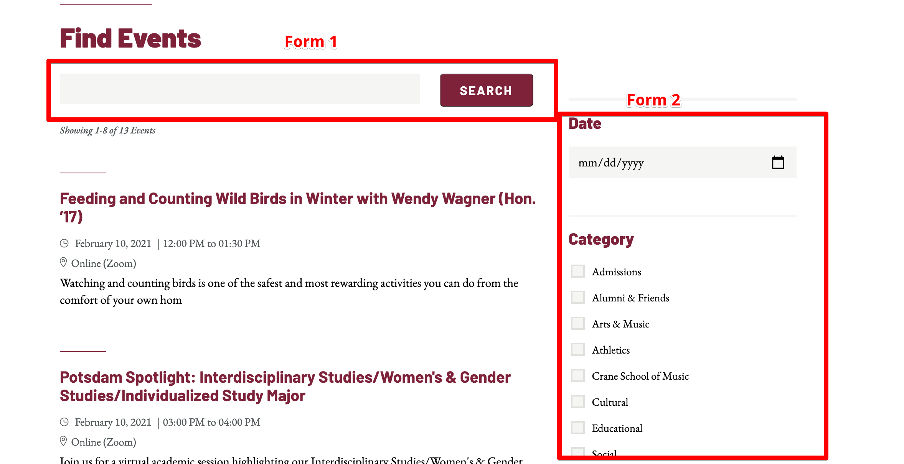
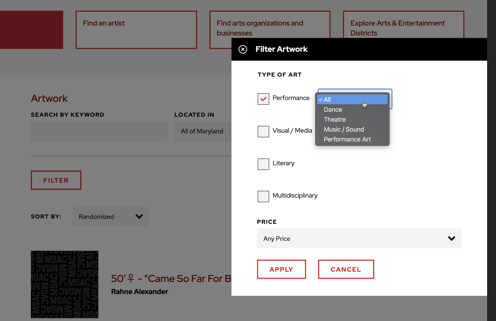

# Views Implementation

When we mention a "view" we are referring to an organized filterable list of content. This may include a simple search bar or additional filters based on fields associated with the entity being listed. Depending on requirements, a view can quickly go from a quick hit task to a task that takes several days to fully implement. Each framework (drupal/wordpress) have different approaches to handling views. In the following sections we'll cover how views are typically managed in projects and when we'll need a more custom alternative solution.

## Drupal

Drupal uses a module called "views" to handle out of the box support for creating filterable lists based on entities defined in Drupal. A view in Drupal is described as follows:

> The views module allows administrators and site designers to create, manage, and display lists of content. Each list managed by the views module is known as a "view", and the output of a view is known as a "display". Displays are provided in either block or page form, and a single view may have multiple displays. Optional navigation aids, including a system path and menu item, can be set for each page-based display of a view. By default, views may be created that list content (a Node view type), content revisions (a Node revisions view type) or users (a User view type). A view may be restricted to members of specific user roles, and may be added, edited or deleted at the views administration page.

Out of the box this functionality provides a powerful tool to quickly build up lists of content that can then be used throughout a drupal site. There are many components to a drupal view each of which we use to configure exactly how a view functions.

### [Components](https://www.drupal.org/docs/user_guide/en/views-parts.html)
A view is broken into several different configurable components which help to further refine the functionality.
* **Format:** Allows configuration of how content lists (table/grid/list) and how each row is displayed (view mode / fields)
* **Fields:** Depends on row format being set to fields. Allows adding one or more fields from the content type to the output
* **Sort Criteria:** Determines the order the content is displayed. This can be based on something simple like the create/update date or a combination of fields such as last name / first name.
* **Filters:** Filters can be hidden or exposed. A hidden filter may be only showing promoted content of a certain type. Exposed filters are displayed to the user on the front end and can help further refine the output. Example here would be a search filter and/or category dropdown filter.
* **Relationships:** Provides the ability to pull in information on related content. An example would be display a description from a related taxonomy term.
* **Contextual Filters:** Similar to regular filters but come from the context of the view such as the URL of the page.
* **Displays:** Each view can have one or more displays, each of which produces one type of output. These can be blocks, embed, json, or even a full page display with a dedicated URL.
* **Header:** Allows inserting details from the global context of the view into the top of the view.
* **Footer:** Allows inserting details from the global context of the view into the bottom of the view.
* **Empty Text:** Text that displays when the view has no results.

### Extended Functionality

There are several use cases that require the addition of other modules that provide extended functionality to views. The following modules add to the complexity and configuration of a view but provide important functionality not available to views out of the box.

* **[Search API](https://www.drupal.org/project/search_api):** By default views provides a simple keyword search on the title/body.  The search API module allows us to create advanced search indexes that search across more than simply the title/body. In most cases our builds depend on this module as client expectations are to search not just title/body but also content built via paragraphs widgets.

* **[Better Exposed Filters](https://www.drupal.org/project/better_exposed_filters):** Replaces the presentational side of views stock filters and provides extended functionality replacing the default single/multi select boxes with radios or checkboxes.

* **[Facets](https://www.drupal.org/project/facets):** Provides faceted search functionality similar to what we'd have available in wordpress utilizing the facetwp plugin.

### Design Challenges

Often times something that may seem straight forward in design actually presents considerable challenges during backend integration and these aren't always immediately apparent. A few examples of issues that have cropped up on previous projects.

1. Breaking apart filters where some filters are above the results and others are beside the results. Drupal views has a single "Exposed Filters" form that gets displayed as a group in a single location. Breaking these form elements apart is incredibly tricky and requires outputting the same form multiple times and hiding the elemnts not needed in each. This is definitely not a best practice and although can be done should be avoided.  

2. Custom filters: Any filter that is beyond a simple input/select/radio/checkbox would be considered a custom filter. Often times the work required to build something like the following would move this from a simple drupal views implementation to a custom front end app utilizing vue.js
  

3. Combining multiple filters: In same cases there is a request to combine two drop down filters into a single list of options to simplify the interface.

4. Cases where cards or similar components where the entire element should be clickable also pose a unique challenge. Due to the way Javascript is initialized on page load, if cards are reloaded in a view as new results are fetched, the Javascript needs to be run on these new cards. This is tricky and requires the use of something like Drupal Behaviors or a MutationObserver to detect when the results have finished loading and we have access to these new elements in the document.

### Considerations

Drupal views provides a powerful out of the box experience with the primary drawback being that you need to do things the way views expects you to do them. The instant we move away from the functionality provided by drupal views then we get into a situation where the best solution might be an entirely custom front end that utilizes the resulting data that views provides but not the front end display.
