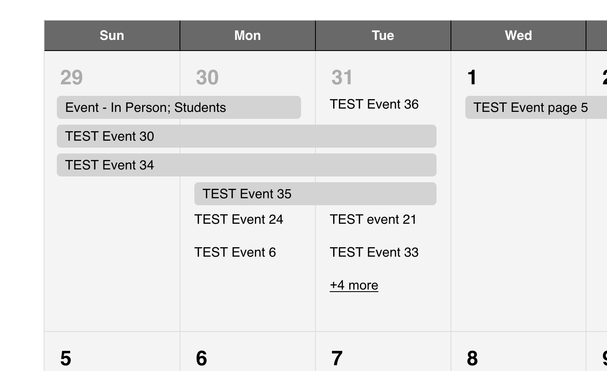

import Tabs from "@theme/Tabs";
import TabItem from "@theme/TabItem";

# Unical

Overview of Unical

This Unical includes two integrated calendar views powered by FullCalendar and custom Vue.js components:
- **Month View**
- **List View**

## Design Resources

- **[UniCal Prototype](https://www.figma.com/proto/J3ysB89ldPIQO0LTADpUaf/%F0%9F%8F%83%E2%80%8D%E2%99%80%EF%B8%8F-Accelerator-Wireframes?page-id=1%3A98&node-id=4061-16966&p=f&viewport=161%2C257%2C0.02&t=OerC0i33QOF5IPYb-1&scaling=min-zoom&content-scaling=fixed&starting-point-node-id=355%3A13806)** - Interactive prototype showing UniCal functionality and design patterns
<Tabs groupId="calendar-views">
  <TabItem value="month" label="Month View" default>

## Month View – FullCalendar Integration

The Unical project integrates the [FullCalendar](https://fullcalendar.io/) JavaScript library to manage and render calendar views. FullCalendar is a powerful and flexible plugin used for event scheduling and display. The Premium version of FullCalendar is used in this project, activated via a license key stored in the `mini-calendar-month.vue` file.

### Features Used

- **dayGridMonth View**: Displays events in a full-month grid layout.
- **Custom Event Rendering**: Custom logic is applied using `eventContent` to conditionally render event titles and times, including a "+X more" indicator when a day has more than three events.
- **Multi-day Event Support**: Events spanning multiple days are tracked and rendered across the relevant days.
- **Dynamic Loading**: Events are dynamically fetched from a Drupal backend using a REST API, based on the current visible date range.
- **Accessibility Enhancements**: Roles and attributes are updated on mount to ensure the calendar meets WCAG 2.1 standards.

## Vue Integration

FullCalendar is imported as a Vue 3 component:

```js
import FullCalendar from "@fullcalendar/vue3";
```

And rendered using:

```html
<FullCalendar :options="calendarOptions" ref="fullCalendar" />
```

The calendar configuration is managed through the `calendarOptions` object.

## Plugins Enabled

- `dayGridPlugin`: Renders the month view.
- `interactionPlugin`: Enables user interaction like event clicks.
- `resourceTimelinePlugin`: Included for potential future use (not enabled by default in UI).

## Accessibility Fixes

Accessibility improvements are made in the `mounted()` lifecycle hook:

- Removing invalid or unnecessary ARIA roles (e.g., `role="presentation"`).
- Ensuring each `<th>` has `scope="col"` and `role="columnheader"`.
- Adding `headers` attributes to `<td>` cells to associate them with the correct headers.

## Styling and Behavior

- Events are styled with transparent backgrounds and borders.
- The "+X more" button appears on days that have more than three single-day events.
- Clicking "+X more" expands the day to reveal all events.
- Event links open in a new tab via `window.open()`.

---

## Developer Notes

### Multi-Day Event Positioning Behavior

By default, FullCalendar tries to group **multi-day events at the top** of the day cell. However, inconsistencies may appear if a single-day event is rendered before a multi-day event or when layout spacing allows it to break the stacking order.

#### Issue Description

In some cases, like the screenshot below, the single-day event `"TEST Event 21"` is rendered above the multi-day event `"TEST Event 35"`, which breaks the expected stacking order.

> This is not a bug in the code, but a limitation of the FullCalendar layout engine.

#### Cause

- FullCalendar handles event stacking based on internal render timing and row space.
- Multi-day events are **not guaranteed** to appear above single-day events if spacing is broken by DOM structure or timing.

## Screenshot Example

Below is an example screenshot showing stacked events:



#### Recommendation

- No immediate fix is needed unless UX requires strict multi-day-first display.
- Optional workarounds:
  - Use `eventOrder` to manually sort.
  - Customize `eventDidMount()` to apply DOM reorder logic.

---

### Console Error – `dayIndex`

#### Error

```bash
TypeError: Cannot read properties of undefined (reading 'dayIndex')
```

This may appear in the console when a user clicks on any day in the mini calendar.

#### Cause

- The issue is related to VCalendar or Nuxt UI’s internal logic.
- It was previously tracked and closed in this GitHub issue:
  - [Nuxt UI Issue #2208](https://github.com/nuxt/ui/issues/2208)

> ⚠️ The fix proposed in that issue does **not** resolve the error in calendar modals.

#### Recommendation

- This error does **not break** the calendar or impact functionality.

</TabItem>

<TabItem value="list" label="List View">

## List View – Vue + VCalendar Integration

The list view provides an accessible and mobile-friendly way to view events using filters, search, and pagination. This view is fully dynamic and works in conjunction with the month view.

### Key Features

- **Dynamic Filtering**: Category-based filters appear in a modal and collapse components.
- **Date Selection**: A VCalendar date picker enables choosing a specific day.
- **Search Integration**: Search input triggers API queries based on date and filters.
- **Pagination**: Results are paged with next/prev/first/last controls.
- **No Results Handling**: Custom "No Events Found" messages based on state (filters/search/month).
- **View Toggling**: Users can toggle between list and month views using provided buttons.

### Components Involved

- `mini-calendar-events.vue`: Renders the list of events and "no results" message.
- `mini-calendar-search.vue`: Handles event search input.
- `mini-calendar-filtermodal.vue`: Filter modal for category/date filters.
- `mini-calendar-calendar.vue`: VCalendar wrapper for inline date picker and selection logic.
- `mini-calendar-pool.vue`: UI for "Reset All" and filter badges.

</TabItem>
</Tabs>

## Plugin References

- [FullCalendar Documentation](https://fullcalendar.io/docs)
- [FullCalendar GitHub Repository](https://github.com/fullcalendar/fullcalendar)
- [VCalendar Documentation](https://vcalendar.io/)
- [VCalendar GitHub Repository](https://github.com/nathanreyes/v-calendar)

## Developer Resources

- [Internal Dev Site](https://dev-idfive-drupal-calendar.pantheonsite.io/events)
