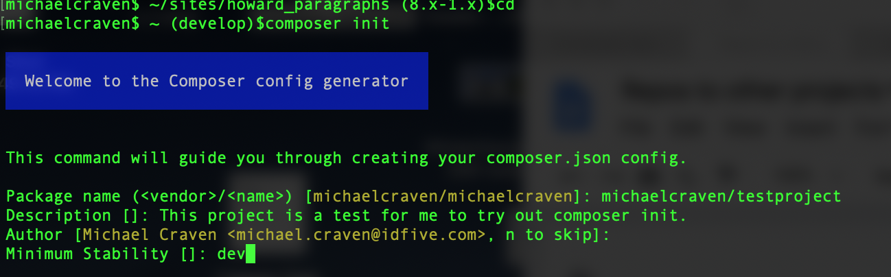
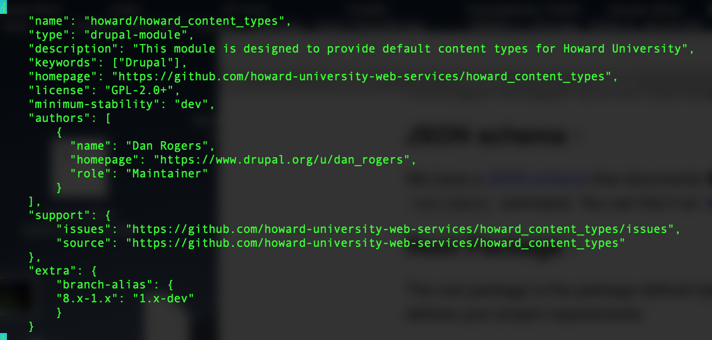
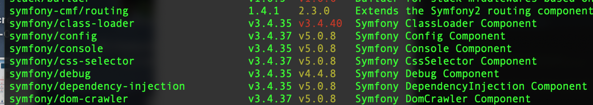
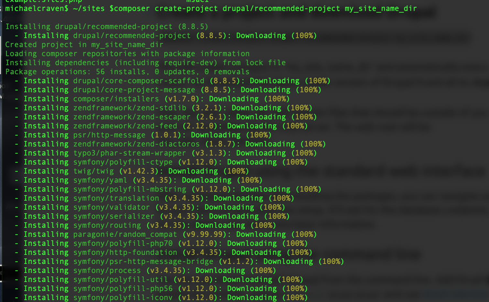

# Composer


## Create

Composer projects are generally created by entering the command:


```
$composer init
```


This command (run from within the project directory), leads the developer through the creation of a composer.json file.





_The composer init command leads the user through the creation of a composer.json file_

The interactive init command allows the developer to define dependencies at init time. But dependencies can also be added using the require command.


## Require/Remove

After the `init` command has been run, dependencies can be added and removed from the composer.json file with the `require` and `remove` commands. Composer `require` adds a new dependency to the project and `remove` removes it.


```
$composer require <group/name>
```


Where the group is the collection (in the case of Howard U repos _howard_) and name is the name of this particular package. For example, the howard_paragraphs project has the following requirements:


```
        "drupal/external_data_source": "*",
        "drupal/paragraphs": "*",
        "drupal/tablefield": "*",
        "drupal/viewsreference": "*",
        "drupal/webform": "*"
```


All drupal modules required for the drupal paragraph widgets. There is no indication of version for any of these dependencies, and so the latest version will be used.


### Version Ranges

You can require specific versions of packages to be installed on a project, but more common is allowing packages to be updated at least with some version constraints. Allowing a package to update without constraints can sometimes lead to an update that breaks the code, but allowing some updates can allow security patches and new features to get in as needed. Version constraints can be added to the require command to restrict which package versions can be downloaded by Composer.

The **tilde** (~) version range allows updating through the next version of higher specificity. For example:


```
$composer require drupal/thing "~1.4"
```


Will allow an update up to version 2; whereas:


```
$composer require drupal/thing "~1.4.3"
```


Will allows updates up to version 1.5.

The **caret** (^) version range always allows updating upto the last non-breaking release. Under composer conventions, that means up to the next major release. So:


```
$composer require drupal/thing "^1.4"
```


Will behave the same as the tilde version range because 2 is the next major release. Whereas:


```
$composer require drupal/thing "^1.4.3"
```


Will also allow updates up to version 2, because all releases within one major release should be backwards compatible. When using the caret version range, the issue more often what is the minimum version required by the application, which may be more specific than a minor release.

Version ranges can also be scoped by comparison operators ( >, >=, &lt;, &lt;=, !=). More than one range can be combined, either with a space ( ) or a (,), which will be treated as an AND, or with a double pipe (||), which will be treated as an OR.


## The Composer.json File





_The composer.json file for the howard content types Drupal module lists metadata for the project_

The official [Composer documentation](https://getcomposer.org/doc/04-schema.md) lists all the properties that may be added to composer.json. The only properties that are required are the name and description fields. However, there are a number of other properties that can be added to give more information about the project. These include:


*   **authors - **an array of author objects, which may each have name, email, homepage, and role property
*   **support** - a object containing various ways to get support including irc, email, issue tracker, etc.
*   **license** - under which license(s) is the package distributed
*   **homepage** - the homepage of the project

Other information in the composer.json file lists information about dependencies of the package.


## Deploy

[Packagist](https://packagist.org) is the main repository for Composer. I aggregates public PHP projects for installation via composer. We submit code distributed through composer to Packagist. The official Packagist documentation has a [page](https://packagist.org/about#naming-your-package) for how to submit packages. The steps it lists are:


*   Naming your package
*   Creating a composer.json file
*   Managing package versions
*   Update Schedule

In short, Packagist provides a form that connects the package with a Github repository. As long as there is a properly made composer.json file, Packagist can pull version number from the tags in the Github repository.


## Maintain

The recommended way to update package versions and the way that idfive does it is outlined by Pacakgist as:

_Enabling the Packagist service hook ensures that your package will always be updated instantly when you push to GitHub._

_To do so you can:_


*   _Make sure you login via GitHub (if you already have an account not connected to GitHub, you can [connect it on your profile](https://packagist.org/profile/edit)). If you are logged in already, log out first then login via GitHub again to make sure you grant us the required permissions._
*   _Make sure [the Packagist application](https://github.com/settings/connections/applications/a059f127e1c09c04aa5a) has access to all the GitHub organizations you need to publish packages from._
*   _Check [your package list](https://packagist.org/profile/) to see if any has a warning about not being automatically synced._
*   _If you still need to setup sync on some packages, try [triggering a manual account sync](https://packagist.org/trigger-github-sync/) to have Packagist try to set up hooks on your account again. Note that archived repositories can not be setup as they are readonly in GitHub's API._

New tags pushed to the Github repository immediately triggers a new release.


*   **require** - lists the dependencies of this package. As long as a nonconflicting versions of packages can be found that meets the constraints in composer.json, they will be downloaded on install.
*   **minimum-stability - **sets a minimum for how stable packages need to be to be included. Possible values are dev, alpha, beta, RC, and stable, Defaults to stable


## Maintaining Projects that Have Composer Dependencies

In the root of a composer project is a composer.json file and a composer.lock file (The [composer documentation](https://getcomposer.org/doc/01-basic-usage.md#commit-your-composer-lock-file-to-version-control) says composer.lock should be put under version control so that collaborators install the right version of each dependency). There may also be a vendor directory if composer install has been run. To check if there are updates to dependencies, run the outdated command:

`$composer outdated`

Outdated will query Packagist and then list the packages that have available updates. The output is color coded. Output that is coded yellow has a new version that may not be backwards compatible to the current version. Upgrading may involve debugging code. Output that is coded red is semver-compatible and you should upgrade it.

In contrast, use the `show` command to see all composer packages.





_Color coding of the composer outdated command._

To upgrade, use the update command:


```
$composer update <package name>
```


Composer will update the package listed in the command so long as it is not prohibited by constraints in composer.json or other dependencies. To update every package, leave off the package name, though be careful making such a big change. Wildcards are also allowed in the update command. For example:


```
$composer update vendor/*
```


Will update all packages of the named vendor.

To see why a package cannot be updated, use the prohibits command.


```
$composer prohibits symfony/polyfill-php72
```


Which returns:


```
symfony/var-dumper  v4.4.4  requires  symfony/polyfill-php72 (~1.5)
```


Composer update will also update the composer.lock file, thus capturing a snapshot of exactly which packages and versions are installed on the project.


## Drupal 8 and Composer

[Drupal uses Composer](https://www.drupal.org/docs/develop/using-composer) to manage the various libraries it uses and it is a good idea to use Composer to manage the modules that make up a Drupal project.


## Set up

Drupal can be downloaded and installed with composer and drush. In part to encourage the use of composer as a dependency manager, drush in Drupal 8 does not include the `dl` command.

The official Drupal documentation has a good page on creating and managing a Drupal project with composer. To begin:


```
$composer create-project drupal/recommended-project <project directory>
```


Will create a new Drupal project in the _project directory_ with the recommended-project template. The recommended-project template is the recommended composer template as of Drupal 8.8.





_Output as the Drupal composer command runs._

From here, the install script can be run from the browser or via drush with the `drush site:install `command run.

Drush site:install (si) asks a series of questions to set up the project, including the database name, etc. to get the site up and running.


## Manage

From here, composer can be used to manage dependencies for contributed modules. On the [Lullabot blog](https://www.lullabot.com/articles/drupal-8-composer-best-practices) James Sansbury makes a case for how complicated dependency management is and composer, with its ability to manage both first level dependencies and nested dependencies.


```
$composer update --with-dependencies drupal/<module_name>
```


Will update not only the module, but the dependencies of the module. Composer update updates code and the composer.lock file, which will need to be pushed to the repository. After running update, running git status will show the new code to stage, commit, and push.


