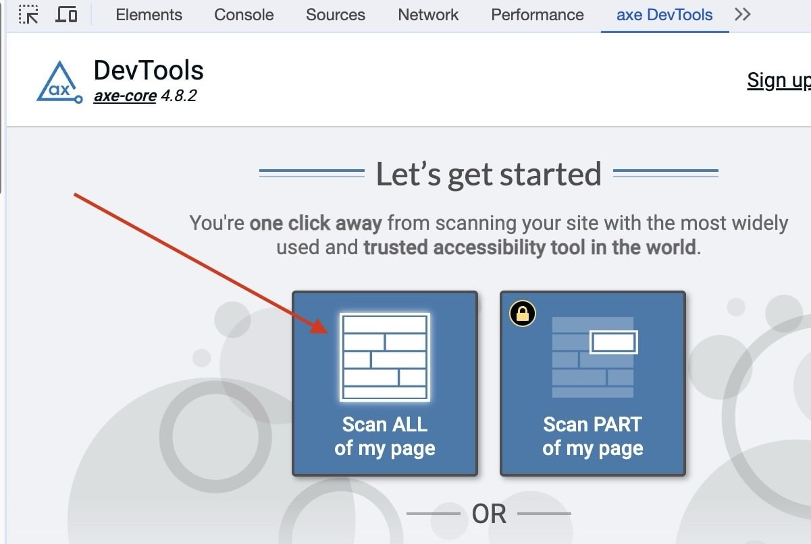
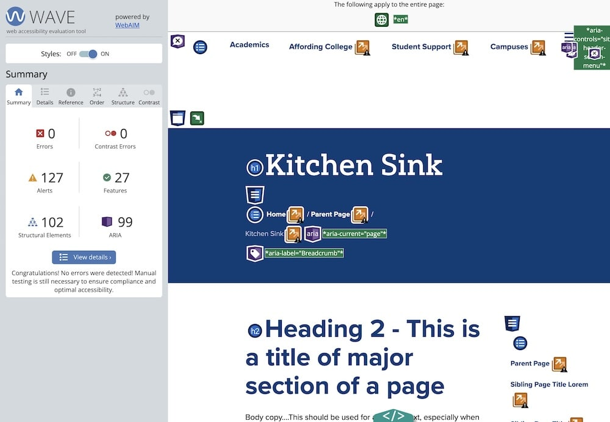

# Accessibility

## Overview

Providing a usable experience to all users, regardless of physical or technological limitations. This should include provisions for users with sight, motor (unable to use mouse/keyboard etc.) and technological constraints (slow internet, older browser, no JavaScript etc.).

### Accessibility Validators

All websites should conform to [WAI WCAG 2.0 AA standards](https://www.w3.org/WAI/standards-guidelines/wcag/). Automatic tools such as WAVE, SiteImprove and Ai11y are useful for highlighting obvious issues, but for full accessibility coverage, a full site audit using a screen reader should be done. A [useful Chrome WAVE extension](https://chrome.google.com/webstore/detail/wave-evaluation-tool/jbbplnpkjmmeebjpijfedlgcdilocofh?hl=en-US) can help with the validation process. Run as my pages as possible through the [W3C Markup Validation Service](https://validator.w3.org/#validate_by_input).

### Semantic Code

Writing semantic code is integral to accessibility, and has the added bonus of SEO benefit (a search bot is really just a user without sight). There isn’t a specific tag for all elements, but familiarize yourself with the elements are available and use them appropriately.

## Testing

All pages/templates should be tested using these three tools:

### Siteimprove Accessibility Checker

The free version of the [Chrome Extension](https://chromewebstore.google.com/detail/siteimprove-accessibility/djcglbmbegflehmbfleechkjhmedcopn) does a great job finding issues and determining where they're located on the page and in the code. This is the preferred accessibility checker as of February 2024 - but running all three checkers documented on this page is required to cast a wide enough net to capture all issues.


The Siteimprove checker will rely on the developer to change the state of the page and re-check. For exmaple run it on page load, after opening the nav, after resizing, after opening a subnav, etc. The more states that can be tested, the more thorough the search will be.

### AXE Dev Tools - Web Accessibility Testing

The free version of the [Chrome Extension](https://chrome.google.com/webstore/detail/axe-devtools-web-accessib/lhdoppojpmngadmnindnejefpokejbdd) works well. This tool does a good job with overall accessibility - and is particularly good with testing keyboard functionality.

Installing the extension will provide a new tab in the dev tools - click "Scan ALL of my page" to run the test


The test should be run for each state of the page, it will not automatically detect all states. For example:

- run the test on inital page load
- open the mobile nav and run
- resize to desktop and run with a dropdown menu open
- repeat for other similar situations (i.e. an open sidenav)

### WAVE Evaluation Tool

This is a good secondary tool to use to make sure anything missed by AXE DevTools is resolved. [Link to Chrome Extension](https://chrome.google.com/webstore/detail/wave-evaluation-tool/jbbplnpkjmmeebjpijfedlgcdilocofh)



- A lot of "false flags" can come up with this tool in terms of color contrast - it's worth confirming whether they are legitimate concerns or not. If a "false flag" can be resolved with a background-color update - it's worth making the update as our clients sometimes will use these tools too.

- There can also be some warnings that may not need resolved, for example in the screenshot above we have warnings for "redundant links", which in this case is because it's testing a dev site where all links are for placement only and point to the same target

## Images

Images should always have at least an empty alt attribute. Without an alt attribute some assistive devices may announce the full image path.

```html

<!-- Bad -->

<!-- Good -->
```

**Note:** It’s okay to have an empty alt attribute. Not all images need to have specific alt text, particularly if it is decorative, or its content is communicated elsewhere in the document.

Images need a width and a height attribute added as much as possible - this helps to prevent layout shifting during loading.

Lazy loading should be added as much as possible to images and iframes (`loading="lazy"`) using the native lazy load attribute.

Avoid using background images as much as possible - this helps with CMS entry and allows for width and height attributes, lazy loading and alt text.

Use the `<picture>` tag if different assets are needed for various device widths:

```css
<picture>
  <source srcset="desktop-image.jpg" media="(min-width: 800px)">
  
</picture>
```

## Forms

### Inputs

Form inputs must have an associated label.

**Example 1:** Label relationship enforced by code structure
The relationship between the input and label is enforced by the input being a child of the label.

```html
<label><input type="checkbox" /> I agree to the terms and conditions</label>
```

**Example 2:** Label relationship enforced by for/id attributes
The relationship is enforced by a unique "id" on the `for` attribute of the label, and the `id` attribute of the input.

```html
<label for="firstname">First name</label>
<input id="firstname" type="checkbox" />
```

## Skip Link

A skip link is required to allow assistive technologies to quickly let users navigate to main content sections. This is placed in **\_head.twig** (located at `source/_meta/_head.twig`). When focused, it becomes visible and links to the `<main>` section (also closes the site header when opened).

```twig
<a class="skip-link" href="#main-content">Skip To Main Content</a>
```

## Sections

Section elements must have an appropriate `aria-label` attribute, or reference a label using the `aria-labelledby` attribute

**Example 1:** aria-label

```html
<section aria-label="Latest news and events">
  <p>Sed posuere consectetur est at lobortis.</p>
</section>
```

**Example 2:** aria-labelledby

```html
<section aria-labelledby="foo">
  <h2 id="foo">Latest news and events</h2>
  <p>Sed posuere consectetur est at lobortis.</p>
</section>
```

## Keyboard navigation

### Overview

Keyboard navigation is typically used by non-sighted users and users with motor disabilities.

- Selectable items should be able to be tabbed through using the keyboard
- The tab order should follow the logic of the document structure
- Hidden elements should not be able to be tabbed through until the element is opened (using the enter key)
  [More info on keyboard accessibility](https://webaim.org/techniques/keyboard/)

### Keyboard focus indicator

A sighted keyboard user must be provided with a visual indicator of the element that currently has keyboard focus. A basic focus indicator is provided automatically by the web browser and is typically shown as a border (called an outline) around the focused element. It is possible to style the indicator, but you should never apply `outline:0` or `outline:none`.

### Hidden Elements

Hidden elements should not be able to be tabbed to. The typescript file \*\*accessibility.tss (located at `source/js/utilities/accessibility.ts`) contains a Mutation Observer that watch for elements with aria-hidden or hidden attribute change and updates the tabindex for focusable children of the target element. This _should_ handle disabling keyboard tabbing for hidden elements, but we need to ensure that `aria-hidden` is bieng set, and that it's working by testing thoroughly.

### Tabbing index

By default, the tabbing index of an element is controlled by the order in which the element appears in the document flow. However, it is possible to manually specify an elements tabbing index using the `tabindex` attribute.

#### Tabindex values

- `tabindex="1"` (or any number greater than 1) defines an explicit tab order. This is almost always a bad idea.
- `tabindex="0"` allows elements besides links and form elements to receive keyboard focus. It does not change the tab order, but places the element in the logical navigation flow, as if it were a link on the page.
- `tabindex="-1"` allows things besides links and form elements to receive "programmatic" focus, meaning focus can be set to the element through scripting, links, etc.

[Read more about tabindex](https://webaim.org/techniques/keyboard/tabindex)

## iFrames

All iframes should have a `title` attribute that describes the content.

**Example 1:** iframe title attribute

```html
<iframe
  title="Video: How to create accessible websites"
  src="https://linktocontent.com/videoid"
></iframe>
```

## Links

### All links should

- Use meaningful link text.
- Avoid the use of text like "click here", per the [w3](https://www.w3.org/QA/Tips/noClickHere).
- If generic text is required, add more context via hidden spans or similar: `<a href="{{ url }}">Learn more<span class="visible-for-screen-readers"> about {{ node.title.value }}</span></a>`
- Avoid target \_blank whenever possible. See below.

### Reasons NOT TO open links in a new tab

- It can be disorienting for people, especially for novice web users or people who have difficulty perceiving visual content.
- It breaks the navigational flow for visitors who visit the website using assistive technologies.
- Opening a new tab on mobile phone can be even more disorienting, as it's especially difficult for the user to go back to the website they were originally browsing.
- Taking away any control from the visitor can have a negative impact on the user experience.
- Besides the impact on accessibility, there is also a possible security issue to keep in mind. Using the attribute target="\_blank" you are leaving your visitors open to possible phishing attacks. The other page can access the window object with the window.opener property. This exposes an attack surface because the other page can potentially redirect your page to a malicious URL.
- If nothing else, remember this principle is also documented as a guideline in the [WCAG (Web Content Accessibility Guidelines)](https://www.w3.org/TR/WCAG20-TECHS/G200.html).

### Reasons TO open links in a new tab

Notable exceptions defined by [WCAG (Web Content Accessibility Guidelines)](https://www.w3.org/TR/WCAG20-TECHS/G200.html):

- Opening a page containing context-sensitive information, such as help instructions, or an alternate means of completing a form, such as a calendar-based date picker, will significantly disrupt a multi-step workflow, such as filling in and submitting a form, if the page is opened in the same window or tab.
- The user is logged into a secured area of a site, and following a link to a page outside of the secured area would terminate the user's logon. In this case opening external links in an external window allows the user to access such references while keeping their login active in the original window.

It is recommended that when links are opened in a new window, there is advance warning.

## Non-JS Fallbacks

When possible, fallbacks should be provided when JavaScript is disabled/unavailable. All functionality can't be replicated, but content should at least be accessible.

A combination of [:target psuedo-class](https://developer.mozilla.org/en-US/docs/Web/CSS/:target) and an additional close button in a `<noscript>` tag can be used to toggle the display of certain components, such as a full site popover menu in a site header.

A css media query `@media (scripting: none) {}` can be used to target elements when javascript is not available.
