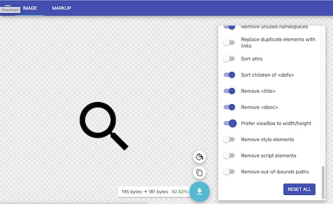
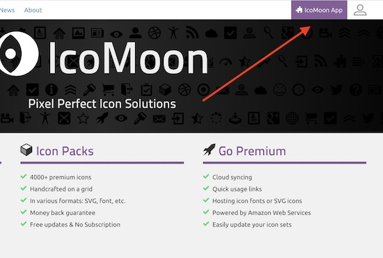
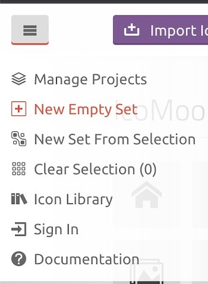
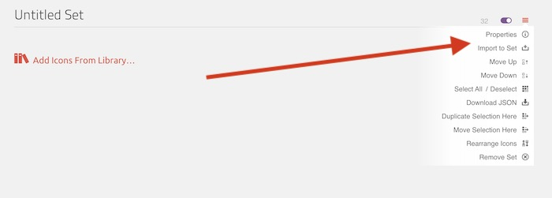

# Images & SVG Icons

## Images

- Images should be placed in the `source/images` directory. To reference an image in a component or page in json use `"../../images/image-name.jpg",`
- Set `width` and `height` attributes for all images
- Provide alt tags when appropriate - [see the accessibility page image section for more info](/docs/front-end/accessibility#images)
- Use the native lazy loading attribute of `loading="lazy"` except for usage in sections that will appear at the top of the page (ie, Site Header or Heroes)
- If different assets are needed depending on viewport width, a `<picture>` tag can be used. Here's an example that can be seen in the hero component at `source/_patterns/components/hero/hero.twig`:

```html
<div class="hero__media">
  <picture>
    <source srcset="{{ hero.image.desktop_src }}" media="(min-width: 768px)" />
    
  </picture>
</div>
```

## Icons (SVGs)

- [IcoMoon](https://icomoon.io/) is used to create a sprite sheet to reference all icons
- Also place a copy of the source svg icons in `source/images/icons` in case they need to be referenced/modified later
- Modified files from IcoMoon will come in the form of a file called `symbol-defs.svg` stored/replaced-on-update at `source/images/icons/icomoon/symbol-defs.svg` and copied into a `iconset.svg` at `source/_patterns/core/iconset/iconset.svg`, which is included on all pages of the site in order to be referenced
- Place (or replace if it already exists) a copy of the `selection.json` file from IcoMoon at `source/images/icons/icomoon/selection.json`, this will allow future developers to modify/update the iconset in IcoMoon


### Preparation

- Ensure with the designer of the project that all strokes in svgs have been outlined. Having one single path is the ideal configuration for an svg. If you have Adobe XD and access to the project source files and need to outline a stroke: select the svg and go to `Object - Path - Outline Stroke`
  

- Remove any fill colors on elements in the svg, this will default colors to black so they can have color applied with css.
- Provide a meaningful name for the icon (no need to include the word "icon" as it will be automatically added when using IcoMoon)
- Optimize the `svg` by running it through [SVGOMG](https://jakearchibald.github.io/svgomg/). Make sure that the "Prefer viewBox over width/height" option is checked in the Global Settings panel. This will replace any usages of `width` and `height` attributes with `viewBox` which allows icons to be responsively scaled on a case-by-case basis.
  
- Create a sub-directory in your projects `images` directory called `icons`: `your-project/source/images/icons`., then create another sub-directory in `icons` called `icomoon` (`your-project/source/images/icons/icomoon`)
- Add your icon svgs here (not the sprite at this point, simply the source svgs if needed again later)
- Create a sub folder called `icomoon` where the files `selection.json` and `symbol-defs.svg` will be placed and updated each time your icon set is updated through IcoMoon - this will allow for future usage and changes from other developers
- The contents of the `symbol-defs.svg` will get copied into the file called `iconset.twig` (each time an update is made)

This sheet should be included as close to the opening `body` tag as possible. Generally it's easiest to create a template that contains the sprite sheet that you can then include in your base layout.

### Using IcoMoon

- Go to [icomoon.io](https://icomoon.io/) and click IcoMoon App in the top-right corner
  
- If starting a new project, click the hamburger menu in the top left and select "New Empty Set"
  

- Click the hamburger menu that appears near the top right.

- Choose "Properties" to update the set name
- Choose "Import to Set" to import svgs from your machine
  
- Once the icons are in the set and ready to be downloaded, choose "Generate SVG & More" from the bottom left
  

- Your downloaded package will contain two files that you will need to pull into your project (or replace if you're updating your project as opposed to starting), these files are `selection.json` and `symbol-defs.svg`. Tracking these files in your repo ensures that you or another developer will be able to re-import into IcoMoon in the future (no login needed for IcoMoon - it uses local storage). The other files in the package can be deleted.
  

- Place (or replace) the `selection.json` and `symbol-defs.svg` files into the directory created earlier at `your-project/source/images/icons`

### Adding to Your Project

- Copy the contents of the `symbol-defs.svg` into a new file called `iconset.svg`. This ideally should exist (in Pattern Lab) at `your-project/source/_patterns/core/iconset/iconset.svg`. Each time you update and re-download from IcoMoon, update the contents of this file to match. Older projects (including fractal) may not have this directory or file, so create to match as needed.
- Ensure that `symbol-defs.svg` is included on each page. In Pattern Lab in the `head.twig` file this is included after the `skip-link` after the opening `<body>` tag as ``. This allows usage of the sprites.
- An example of using a sprite (note the use a `visible-for-screen-readers` class here in use if the icon is more than directory [i.e. if it's button to click, indicate what it does here]):

```html
<span class="visible-for-screen-readers"
  >Name of icon for screen readers (if applicable)</span
>
<svg aria-hidden="true" width="20" height="20">
  <use xlink:href="#icon-id"></use>
</svg>
```
