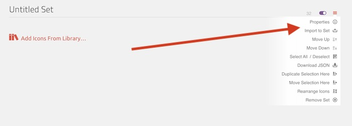
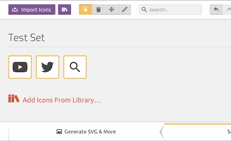
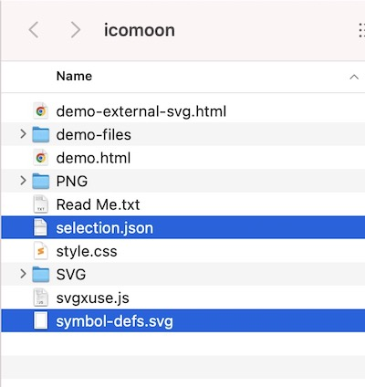

import Tabs from "@theme/Tabs";
import TabItem from "@theme/TabItem";


# Images & SVG Icons

## Images
<Tabs groupId="icl-versions">
  <TabItem value="v3.0" label="ICL Version 3+ (Astro)">
  Images should be placed in the `public/images` directory.

  These will be copied to the `/dist` folder when the build command is run.
  </TabItem>
  <TabItem value="v2.0" label="ICL Version < 3 (Pattern Lab)">
    Images should be placed in the `source/images` directory.
  </TabItem>
</Tabs>
### Markup Guidelines

- To reference an image in a component or page in json use `"../../images/image-name.jpg",`
- Set `width` and `height` attributes for all images
- Provide alt tags when appropriate - [see the accessibility developer guidelines for more info](/docs/accessibility/developers#images)
- Use the native lazy loading attribute of `loading="lazy"` except for usage in sections that will appear at the top of the page (ie, Site Header or Heroes)
- If different assets are needed depending on viewport width, a `<picture>` tag can be used. Here's an example that can be seen in the hero component (the hero would not typically use the `loading="lazy"` attribute, but adding in for the example):

```html
<div class="hero__media">
  <picture>
    <source srcset="{{ hero.image.desktop_src }}" media="(min-width: 768px)" />
    
  </picture>
</div>
```

### Styling
#### Responsive Images
- Use the `object-fit` property to maintain aspect ratios for images
- A helper class of `.responsive-img` can be extended to simplify image styling:

```css
.responsive-img {
  width: 100%;
  iframe,
  img {
    display: block;
    height: 100%;
    width: 100%;
    object-fit: cover;
    object-position: center;
  }
}
```

To use this - apply to the div that contains the image and update the aspect-ratio to your needs. The `aspect-ratio` css property [MDN Reference](https://developer.mozilla.org/en-US/docs/Web/CSS/aspect-ratio) can be used to size the image according to the design. Fractions can be used (ie `16/9`), but when more complicated ratios are needed, a decimal value can be used by dividing the width by the height (ie if the width is 606px by 340 tall, `606/340 = 1.78`).

```css
.hero__media {
  @extend .responsive-img;
  aspect-ratio: 1.78;
}
```

#### Background Images (Astro)
To use a `background-image` in css, the path to use is `background-image: url("/images/image-name.jpg");`. This will ensure that it works when running the ICL alone, as well as when used in conjunction with the Drupal and Wordpress Accelerators.

## Icons (SVGs)

[IcoMoon](https://icomoon.io/) is used to create a sprite sheet to reference all icons.

### SVG Preparation
- Remove any fill colors on elements in the svg, this will default colors to black so they can have color applied with css.
- Provide a meaningful name for the icon (no need to include the word "icon" as it will be automatically added when using IcoMoon)
- Optimize the `svg` by running it through [SVGOMG](https://jakearchibald.github.io/svgomg/). Make sure that the "Prefer viewBox over width/height" option is checked in the Global Settings panel. This will replace any usages of `width` and `height` attributes with `viewBox` which allows icons to be responsively scaled on a case-by-case basis.
  

### Using IcoMoon

- Go to [icomoon.io](https://icomoon.io/) and click IcoMoon App in the top-right corner
  
- If starting a new project, click the hamburger menu in the top left and select "New Empty Set"
  

- Click the hamburger menu that appears near the top right.

- Choose "Properties" to update the set name
- Choose "Import to Set" to import svgs from your machine
  
- Once the icons are in the set and ready to be downloaded, choose "Generate SVG & More" from the bottom left
  

- Your downloaded package will contain two files that you will need to pull into your project (or replace if you're updating your project as opposed to starting), these files are `selection.json` and `symbol-defs.svg`. Tracking these files in your repo ensures that you or another developer will be able to re-import into IcoMoon in the future (no login needed for IcoMoon - it uses local storage). The other files in the package can be deleted.
  

- Place (or replace) the `selection.json` and `symbol-defs.svg` files into the directory created earlier at `your-project/source/images/icons`

### Adding to Your Project

<Tabs groupId="icl-versions">
  <TabItem value="v3.0" label="ICL Version 3+ (Astro)">
    - Place a copy of the source svg icons from the design file in `public/images/icons` in case they need to be referenced/modified later
    - Modified files from IcoMoon will come in the form of a file called `symbol-defs.svg` stored/replaced-on-update at `source/images/icons/icomoon/symbol-defs.svg` and copied into a `iconset.svg` at `src/components/iconset/iconset.svg`, which is included on all pages of the site in order to be referenced
    - Place (or replace if it already exists) a copy of the `selection.json` file from IcoMoon at `source/images/icons/icomoon/selection.json`, this will allow future developers to modify/update the iconset in IcoMoon
  </TabItem>
  <TabItem value="v2.0" label="ICL Version < 3 (Pattern Lab)">
    - Place a copy of the source svg icons from the design file in `source/images/icons` in case they need to be referenced/modified later
    - Modified files from IcoMoon will come in the form of a file called `symbol-defs.svg` stored/replaced-on-update at `source/images/icons/icomoon/symbol-defs.svg` and copied into a `iconset.svg` at `source/_patterns/core/iconset/iconset.svg`, which is included on all pages of the site in order to be referenced
    - Place (or replace if it already exists) a copy of the `selection.json` file from IcoMoon at `source/images/icons/icomoon/selection.json`, this will allow future developers to modify/update the iconset in IcoMoon
  </TabItem>
</Tabs>

### SVG Usage
To use a sprite use the following syntax, where `#icon-id` matches the name of the `<symbol>` to the desired icon in `iconset.svg`

```html
<span class="visible-for-screen-readers">Name of icon (acts as alt text for screen readers not a decorative image. Can be skipped if decorative)</span>
<svg aria-hidden="true" width="20" height="20">
  <use xlink:href="#icon-id"></use>
</svg>
```
