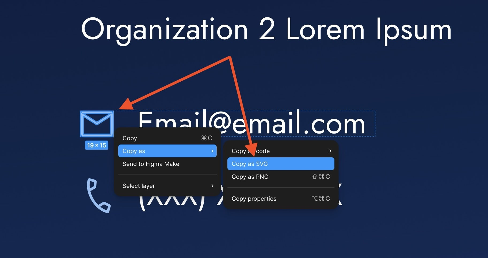
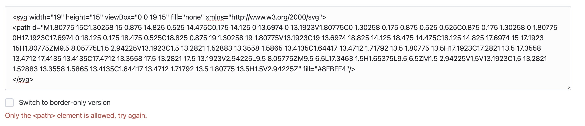
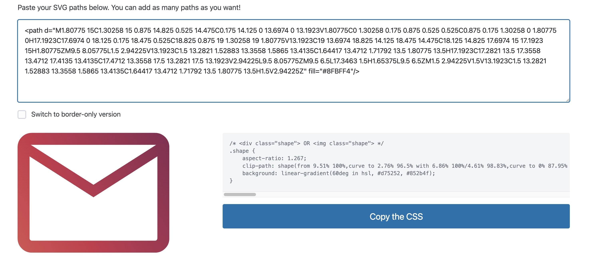
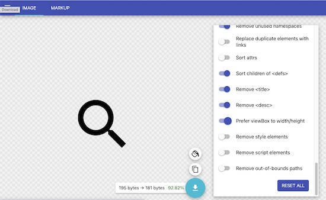
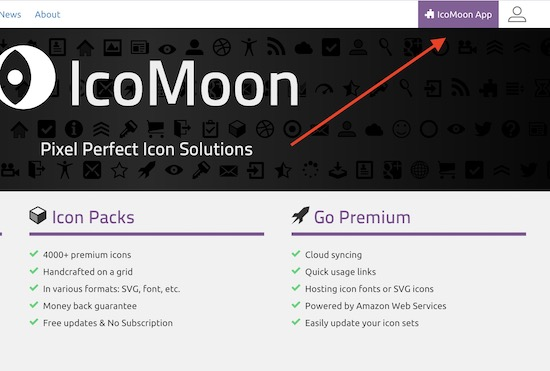
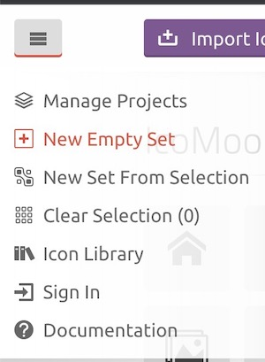
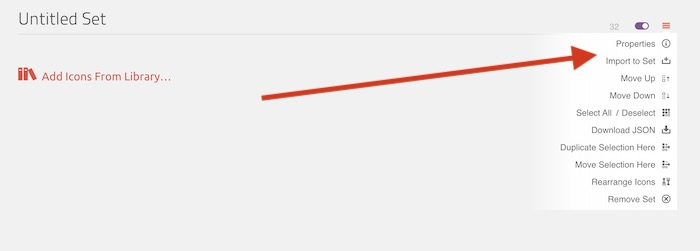
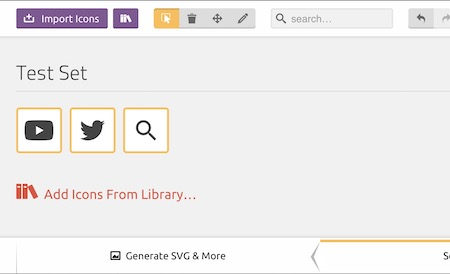
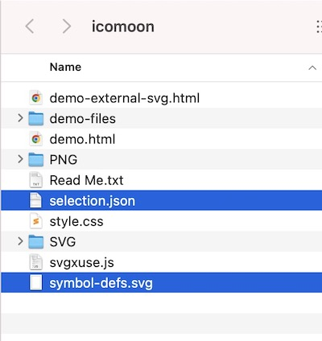

import Tabs from "@theme/Tabs";
import TabItem from "@theme/TabItem";

# Images & SVG Icons

## Images

<Tabs groupId="icl-versions">
  <TabItem value="v3.0" label="ICL Version 3+ (Astro)">
  Images should be placed in the `public/images` directory.

These will be copied to the `/dist` folder when the build command is run.

  </TabItem>
  <TabItem value="v2.0" label="ICL Version < 3 (Pattern Lab)">
    Images should be placed in the `source/images` directory.
  </TabItem>
</Tabs>
### Markup Guidelines

- To reference an image in a component or page in json use `"../../images/image-name.jpg",`
- Set `width` and `height` attributes for all images
- Provide alt tags when appropriate - [see the accessibility developer guidelines for more info](/docs/accessibility/developers#images)
- Use the native lazy loading attribute of `loading="lazy"` except for usage in sections that will appear at the top of the page (ie, Site Header or Heroes)
- If different assets are needed depending on viewport width, a `<picture>` tag can be used. Here's an example that can be seen in the hero component (the hero would not typically use the `loading="lazy"` attribute, but adding in for the example):

```html
<div class="hero__media">
  <picture>
    <source srcset="{{ hero.image.desktop_src }}" media="(min-width: 768px)" />
    
  </picture>
</div>
```

### Styling

#### Responsive Images

- Use the `object-fit` property to maintain aspect ratios for images
- A helper class of `.responsive-img` can be extended to simplify image styling:

```css
.responsive-img {
  width: 100%;
  iframe,
  img {
    display: block;
    height: 100%;
    width: 100%;
    object-fit: cover;
    object-position: center;
  }
}
```

To use this - apply to the div that contains the image and update the aspect-ratio to your needs. The `aspect-ratio` css property [MDN Reference](https://developer.mozilla.org/en-US/docs/Web/CSS/aspect-ratio) can be used to size the image according to the design. Fractions can be used (ie `16/9`), but when more complicated ratios are needed, a decimal value can be used by dividing the width by the height (ie if the width is 606px by 340 tall, `606/340 = 1.78`).

```css
.hero__media {
  @extend .responsive-img;
  aspect-ratio: 1.78;
}
```

#### Background Images (Astro)

To use a `background-image` in css, the path to use is `background-image: url("/images/image-name.jpg");`. This will ensure that it works when running the ICL alone, as well as when used in conjunction with the Drupal and Wordpress Accelerators.

## Icons

**Versions of the [ICL later than 3.2.14](https://bitbucket.org/idfivellc/idfive-component-library/downloads/?tab=tags) do not use a spritesheet or icomoon for icons.**
The current process involves using the CSS `Shape()` function ([link to MDN Docs](https://developer.mozilla.org/en-US/docs/Web/CSS/Reference/Values/basic-shape/shape)) and a tool for SVG to CSS Shape conversion.

### CSS Shapes

#### Overview
Icon shapes are located as custom properties in `/src/assets/css/core/variables--icons.css`. 

A comment is placed above the icon for identification (`/* prettier-ignore */` is used to prevent prettier from breaking the code into separate lines - causing a very long document). For example:
  ```css
  /* Email */
  /* prettier-ignore */
  --icon-email: shape(from 10% 100%, curve by -0.14% 0% with -0.04% 0%/-0.09% 0%, curve by -6.92% -3.67% with -2.72% 0%/-5.17% -1.41%, line by 0% 0%, curve by -2.94% -8.66% with -1.81% -2.19%/-2.94% -5.26%, curve by 0% -0.18% with 0% -0.06%/0% -0.12%, line by 0% 0.01%, vline by -75%, curve by 2.94% -8.83% with 0% -3.44%/0.98% -6.38%, curve by 6.92% -3.67% with 1.75% -2.26%/4.2% -3.67%, curve by 0.15% 0% with 0.05% 0%/0.1% 0%, line by -0.01% 0%, hline by 80%, curve by 7.06% 3.67% with 2.75% 0%/5.1% 1.22%, curve by 2.94% 8.83% with 1.96% 2.45%/2.94% 5.39%, vline by 75%, curve by -2.94% 8.83% with 0% 3.44%/-0.98% 6.37%, curve by -6.92% 3.67% with -1.75% 2.27%/-4.21% 3.67%, curve by -0.14% 0% with -0.05% 0%/-0.1% 0%, line by 0.01% 0%, hline by -80%, close, move to 50% 56.25%, line by -40% -31.25%, vline by 62.5%, hline by 80%, vline by -62.5%, line by -40% 31.25%, close, move to 50% 43.75%, line by 40% -31.25%, hline by -80%, line by 40% 31.25%, close, move to 10% 25%, vline by 0%, close);
  ```

#### Usage
 These custom properties are added in css in a `clip-path`, typically inside a `<span>` or pseudo-element depending on the context. For example `clip-path: var(--icon-email);`
 The CSS Shape is masking a block-level element, use `background-color` to set it's color. 
 ```css
.person-detail-hero__icon-email {
  clip-path: var(--icon-email);
  background-color: var(--color-black);
  width: 24px;
  display: inline-block;
  aspect-ratio: 1.25;
}
 ```
The `background-color` can be transitioned for hover states.

#### Adding/Updating An Icon
The process of adding or updating an icon relies on using the [SVG To CSS Generator](https://css-generators.com/svg-to-css/) tool and copying the output into the `variables--icons.css` file mentioned above. This process will only work with monochromatic SVGs, this will not (easily) support multiple colors. 
- Copy the SVG code to the clipboard and paste into the [tool](https://css-generators.com/svg-to-css/)

- In the tool notice the error `Only the <path> element is allowed, try again.`, simply delete the `<svg>` starting and `</svg>` ending tags

- Visually confirm that the output in the generator matches the svg (ignore the color gradient, this will be applied as a solid color in css)

- Click the "Copy the CSS" button to copy to clipboard, the two relevant css properties are the `clip-path` and the `aspect-ratio`
— Replace or add the value of the `clip-path` property as a new icon in the `variables--icons.css` file
- Usage varies depending on the context, here is an example of a social media icon in use in the footer. Note that the `aspect-ratio` is helpful here to keep the correct shape, allowing for only the width (or height) to be changed without needing to change both values:
```css
&::before {
  content: "";
  aspect-ratio: 1.004;
  clip-path: var(--icon-facebook);
  display: block;
  width: 25px;
  background-color: var(--color-white);
}
```

### IcoMoon (Older ICL versions)

[IcoMoon](https://icomoon.io/) is used to create a sprite sheet to reference all icons:
<details>
  <summary>SVG Preparation</summary>
- Remove any fill colors on elements in the svg, this will default colors to black so they can have color applied with css.
- Provide a meaningful name for the icon (no need to include the word "icon" as it will be automatically added when using IcoMoon)
- Optimize the `svg` by running it through [SVGOMG](https://jakearchibald.github.io/svgomg/). Make sure that the "Prefer viewBox over width/height" option is checked in the Global Settings panel. This will replace any usages of `width` and `height` attributes with `viewBox` which allows icons to be responsively scaled on a case-by-case basis.
  
</details>
<details>
  <summary>Using IcoMoon</summary>
- Go to [icomoon.io](https://icomoon.io/) and click IcoMoon App in the top-right corner
  
- If starting a new project, click the hamburger menu in the top left and select "New Empty Set"
  

- Click the hamburger menu that appears near the top right.

- Choose "Properties" to update the set name
- Choose "Import to Set" to import svgs from your machine
  
- Once the icons are in the set and ready to be downloaded, choose "Generate SVG & More" from the bottom left
  

- Your downloaded package will contain two files that you will need to pull into your project (or replace if you're updating your project as opposed to starting), these files are `selection.json` and `symbol-defs.svg`. Tracking these files in your repo ensures that you or another developer will be able to re-import into IcoMoon in the future (no login needed for IcoMoon - it uses local storage). The other files in the package can be deleted.
  

- Place (or replace) the `selection.json` and `symbol-defs.svg` files into the directory created earlier at `your-project/source/images/icons`
</details>

<details>
  <summary>Adding to Your Project</summary>

<Tabs groupId="icl-versions">
  <TabItem value="v3.0" label="ICL Version 3+ (Astro)">
    - Place a copy of the source svg icons from the design file in
    `public/images/icons` in case they need to be referenced/modified later -
    Modified files from IcoMoon will come in the form of a file called
    `symbol-defs.svg` stored/replaced-on-update at
    `source/images/icons/icomoon/symbol-defs.svg` and copied into a
    `iconset.svg` at `src/components/iconset/iconset.svg`, which is included on
    all pages of the site in order to be referenced - Place (or replace if it
    already exists) a copy of the `selection.json` file from IcoMoon at
    `source/images/icons/icomoon/selection.json`, this will allow future
    developers to modify/update the iconset in IcoMoon
  </TabItem>
  <TabItem value="v2.0" label="ICL Version < 3 (Pattern Lab)">
    - Copy the contents of the `symbol-defs.svg` into a new file called `iconset.svg`. This ideally should exist (in Pattern Lab) at `your-project/source/_patterns/core/iconset/iconset.svg`. Each time you update and re-download from IcoMoon, update the contents of this file to match. Older projects (including fractal) may not have this directory or file, so create to match as needed.
    - Ensure that `symbol-defs.svg` is included on each page. In Pattern Lab in the `head.twig` file this is included after the `skip-link` after the opening `<body>` tag as ``. This allows usage of the sprites.
  </TabItem>
</Tabs>
</details>
<details>
  <summary>SVG Usage</summary>
To use a sprite use the following syntax, where `#icon-id` matches the name of the `<symbol>` to the desired icon in `iconset.svg`

```html
<span class="visible-for-screen-readers"
  >Name of icon (acts as alt text for screen readers not a decorative image. Can
  be skipped if decorative)</span
>
<svg aria-hidden="true" width="20" height="20">
  <use xlink:href="#icon-id"></use>
</svg>
</span>
```
</details>