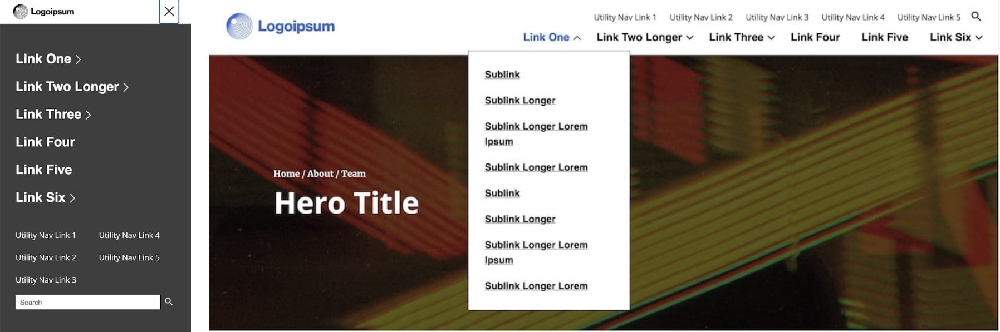

# Pattern Lab Starter

## Introduction

**The Pattern Lab Starter (formerly _ICL_) is a collection of components to be used to begin new front-end development projects.**

### Staging Site

The Pattern Lab Starter can be viewed on our staging site at [this link](https://staging2.idfive.com/idfive-pattern-lab-starter/public/?p=pages-welcome)

### Download

To download the starter [visit the Bitbucket Repo Downloads - Tags](https://bitbucket.org/idfivellc/idfive-pattern-lab-starter/downloads/?tab=tags) and under "Download", select a zip file of the latest tag. Downloading this way as opposed to cloning the repo will remove the git tracking (so it can be connected to the new project) and ensure that the latest intended version is pulled (new versions tagged when ready for production).

### Interface

Official Pattern Lab documentation can be [found here](https://patternlab.io/). The site navigation is typically on the left side of the page (it can be moved to the top by selecting "switch layout", but the left side is the default). There are three main (iinitially collapsed) sections:

- **Components** is a list of all available components - not in a page context
- **Core** contains misc site elements such as colors in use (this is optional, would need manually updated per site), and an invisible section called the iconset, which contains a sprite sheet for all of the svg icons
- **Pages** contains fully built out pages, this is typically where review occurs

### Installation

In a terminal window at the root of the pattern lab starter - run the followiing commands:

- `nvm use`
- `npm install`
- `npm run develop`

This will open the "Welcome page", changes made in code will automatically be refreshed/reflected in the browser.

## Folder Structure

The source directory contains the main working areas for the library. More information can be found [here](https://patternlab.io/docs/editing-pattern-lab-source-files/).

- **Annotations** is not in use, but can be used as an alternate way of documenting components (insead of placing the documentation in the respective component folder)
- **Data** contains global data, currently the starter library consists of `data.json` which holds data for global components such as the site-header and site-footer (this prevents the data from needing to be repeated for multiple instances). This can be re-organized/customized to suit developer needs
- **Meta** contains the header and footer code that gets applied to all patterns and pages. `_head.twig` contains all of the html and header starting code and `_foot.twig` for footer and ending html code/tags - more info can be found [here](https://patternlab.io/docs/modifying-the-pattern-header-and-footer/)
- **Patterns** contains the bulk of the code in use (components, core & pages). The three directories in here correlate to what is seen in the browser interface and are documented [above](pattern-lab#interface)
- **CSS** contains the scss partial files, compiled into `index.scss`.
  - **components** contain a scss partial corresponding to each individual compoennt
  - **core** contains base, layout, functions, mixins, variables, placeholder-seclectors and typography scss partials
  - **index.scss** pulls all partial files in, as well as linking to third-party library css if needed (node_module directories)
  - **pattern-scaffolding.css** is only in use for the pattern lab directory if custom styles are needed (namely the color palettes in core > colors)
  - **print.css** is called solely for print media, the starter can be used as a base - to be customized for each site
- **Fonts** is empty by default (Google Fonts are linked to in `_head.twig` for the sarter version), but local fonts can be added to this directory
- **Images** contains all starter images, as well as icons and svgs
- **JS** contains all typescript modules:
  - **components** contains individual modules for respective components (when required for functionality)
  - **utilities** contains helpful accessibility functions that can be used to simply certain tasks
  - **maint.ts** imports all functions and calls init functions for each (this file gets compiled into one on build)

## CSS

### Core

An explanation/use-case for all of the partials in the "core" directory, to be updated these files as needed per project.

- **base.scss** - root styling (html, body, etc) as well as containing skip link and WYSIWYG image styles
- **functions.scss** - sass math functions, currently contains the function to convert `rem(pixel-value)` to correct rem value
- **layout.scss** - main section, off-canvas, max-bound, and outer-padding
- **mixins.scss** - sass mixins, currently contains the media query mixin
- **placeholder-selectors.scss** - contains repeated patterns used globally, currently contains:
  - `%visible-for-screen-readers` - hide content and only output for screenreaders
  - `%responsive-img` - use this in conjunction with `&:before { padding-top: aspect-ratio%; }` to size images accordingly. The aspect-ratio can be found by dividing the image height by the width and multiplying by 100. For example a 16 by 9 image (1600px by 900 for simplicity) would be `(900/1600) * 100 = 56.25` or `padding-top: 56.25%`
  - `%negate-outer-pad-x` this can be used to negate the outer-padding used on a page wrapper to make a component full-width (values/variables need updated to reflect outer-padding values/variables)
  - `%caption` used for text styles on captions in various components (WYSIWYG images, videos, etc)
- **typography.scss** - set the `body` base style, as well as `a`, `p`, `ul` & `ol`, as well as heading type styles
- **variables.scss** - currently contains colors, outer-padding, and font-family variables

## Layout

### Outer Padding

#### Inline (Left & Right) Padding

A `div` has been placed as a direct descendent of the `<main>` tag with a class of `outer-pad`. This should be used to match the left and right spacing seen in the design reference (differs per project). The value will typically change according to screen-width and could also change per page template-type.
In **layout.scss** we have:

```scss
.outer-pad,
%outer-pad {
  padding-inline: $outer-inline-padding-mobile;
  @include mq($min, $tablet) {
    padding-inline: $outer-inline-padding-tablet;
  }
  @include mq($min, $lg_desktop) {
    padding-inline: $outer-inline-padding-desktop;
  }
}
```

These values correspond to the variables seen in `source/css/core/_variables.scss` and should be updated as needed:

```scss
//Outer Padding Widths (for layout)
$outer-inline-padding-mobile: rem(33);
$outer-inline-padding-tablet: rem(60);
$outer-inline-padding-desktop: rem(120) rem(300);
```

Notice that the desktop value contains two values (a left and right) since often the content will not be centered at desktop widths (and to account for the sidenav)

#### Different Padding Per Page Template

Depending on the complexity of the project, if there are many different values based on page template (for example a kitchen-sink might have different spacing than a homepage for example), more variables will need to be added to account for this. For example:

```scss
.outer-pad,
%outer-pad {
  padding-inline: $outer-inline-padding-mobile;
  // Target the body class of the template that requires a different value
  body.page-class & {
    // Create new variable for the different value if desired
    padding-inline: $outer-inline-padding-mobile-page-class;
  // Rest of code
```

#### Negating Outer Padding for Full Width Components

These variables also correspond to the placeholder selector in `source/css/core/_placeholder-selectors.scss` with the name of `%negate-outer-pad-x`:

```scss
%negate-outer-pad-x,
.negate-outer-pad-x {
  margin-inline: -$outer-inline-padding-mobile;
  @include mq($min, $tablet) {
    margin-inline: -$outer-inline-padding-tablet;
  }
  @include mq($min, $lg_desktop) {
    margin-inline: rem(-120) rem(-300);
  }
}
```

- Notice that the desktop `@include mq($min, $lg_desktop) {` styles are using values instead of variables, this is due to the fact adding a negative `-` symbol to the variable won't work here since there are two values to the variable (since the design is off center on desktop) and the negative/subtract symbol would only apply to the first value
- Feel free to use additional variables to account for this if desired, I've gone this route for simplicty's sake
- If different values are required per template, such as in the [example above](#different-padding-per-page-template), these will need to be updated/reflected in the `%negate-outer-pad-x` selector

#### Padding-Top for the `<main>` Element

The `<main`> element will need `padding-top` set to the height of the site-header (since the site-header is set to `position: fixed` and will not push down `<main>`).

```scss
main {
  padding-top: rem(55);
  @include mq($min, $lg_desktop) {
    padding-top: rem(102);
  }
}
```

- The `rem(55)` corresponds to the site header having a height of `55px` on mobile and `rem(102)` to the height of `102px` on larger desktops
- These could be set to variables if desired

### Site Width

There is no `max-width` set on the site. Instead, since we're using rems throughout - we can increase the size (essentially scale) the site at larger viewport widths. In `source/css/core/_base.scss` the `html` element has the following style applied at the `max_desktop` width:

```scss
html {
  // other styles not relevant to site width not displayed here for clarity
  @include mq($min, $max_desktop) {
    font-size: calc(100% + 0.2vw);
  }
}
```

Updating the font size with a small `vw` unit here will dynamically increase the value of rems throughout the site, giving the scaling effect.

## Images & Icons

### Images

- Images should be placed in the `source/images` directory. To reference an image in a component or page in json use `"../../images/image-name.jpg",`
- Set `width` and `height` attributes for all images
- Provide alt tags when appropriate - [see the accessibility page image section for more info](/docs/front-end/accessibility#images)
- Use the native lazy loading attribute of `loading="lazy"`
- If different assets are needed depending on viewport width, a `<picture>` tag can be used. Here's an example that can be seen in the hero component at `source/_patterns/components/hero/hero.twig`:

```html
<div class="hero__media">
  <picture>
    <source srcset="{{ hero.image.desktop_src }}" media="(min-width: 768px)" />
    
  </picture>
</div>
```

### Icons (SVGs)

- [IcoMoon](https://icomoon.io/) is used to create a sprite sheet to reference all icons
- Also place a copy of the source svg icons in `source/images/icons` in case they need to be referenced/modified later
- Modified files from IcoMoon will come in the form of a file called `symbol-defs.svg` stored/replaced-on-update at `source/images/icons/icomoon/symbol-defs.svg` and copied into a `iconset.svg` at `source/_patterns/core/iconset/iconset.svg`, which is included on all pages of the site in order to be referenced
- Place (or replace if it already exists) a copy of the `selection.json` file from IcoMoon at `source/images/icons/icomoon/selection.json`, this will allow future developers to modify/update the iconset in IcoMoon
- Full documentation on the process can be [found here](/docs/front-end/svg)

## Components

### Site Header


The site header supports dropdown menus, a utility nav and a pop-up search form.
