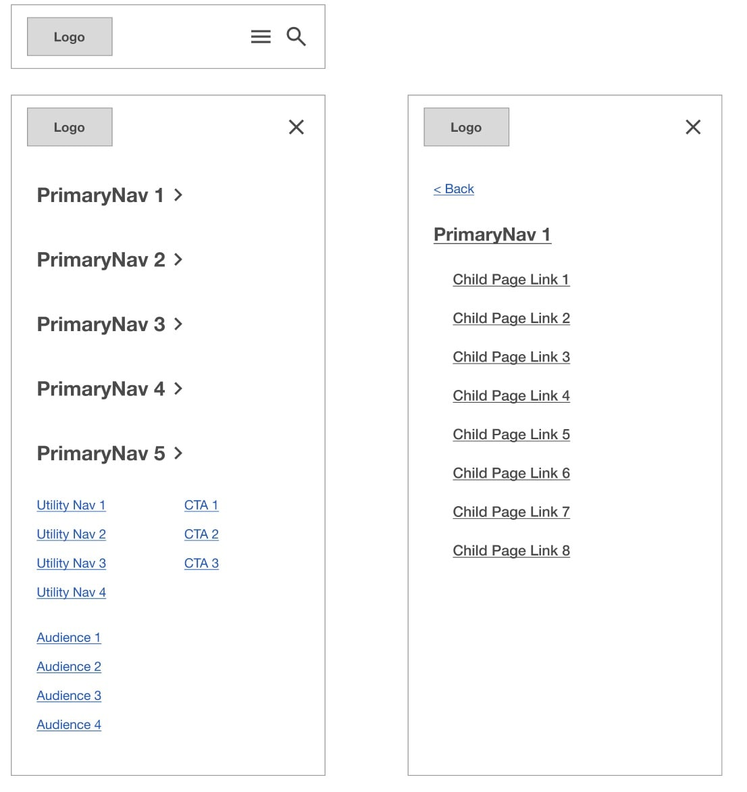
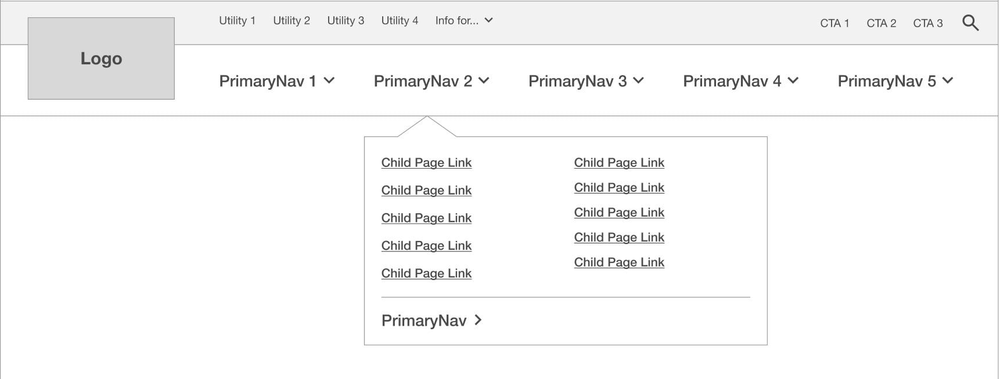
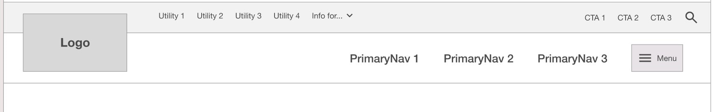
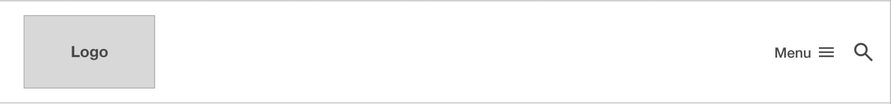
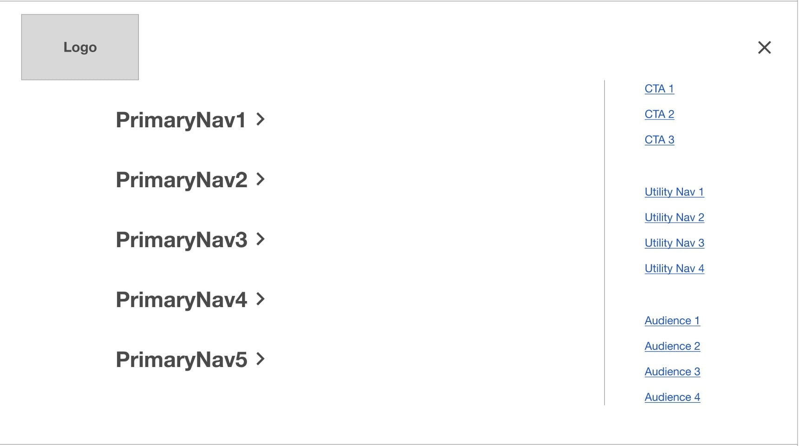
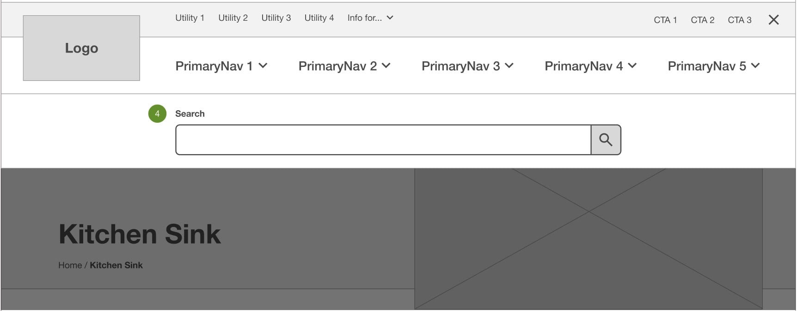

# Site Header

The site header comes with 3 built-in variations.
[More information can be found in the wireframes](https://www.figma.com/proto/6rjiTrzRov6VwxFgwVPbXg/UX-Starter-Doc?page-id=1%3A98&node-id=141-699&viewport=755%2C325%2C0.08&t=eN5CbnlbijyARmGo-1&scaling=min-zoom&content-scaling=fixed&starting-point-node-id=355%3A13806).

## Changing the Site Header Variation

The default mode fort he site header is "Full" (see below). To change to a different variation, go into **data.json** (at **source/\_data/data.json**) and change the "type" under "site header".

**When "type" is left blank - it will show the "full" version**:

For _Full_:

```json
"site_header": {
    "type": "",
}
```

For _Hamburger_:

```json
"site_header": {
    "type": "hamburger",
}
```

For _Hybrid_:

```json
"site_header": {
    "type": "hybrid",
}
```

## Variables

The partial file **\_base.scss** (located at `source/scss/core/_base.scss`) contains custom properties (variables) used in conjunction with the site header, to be updated per project based on design needs. These custom properties need to be kept in place as they are used in various formulas (for example, to determine the `padding-top` value of the `<main>` section). The relevant variables and default values are as follows:

```scss
:root {
  --header-top-height: #{rem(90)};
  --header-logo-width: #{rem(106)};
  --header-main-menu-height: #{rem(100)};
  @include mq($min, $lg_desktop) {
    --header-top-height: #{rem(64)};
    --header-logo-width: #{rem(212)};
  }
}
```

- `--header-top-height` refers to the top section applied to `site-header__top` which appears on mobile and desktop, typically containing utility and audience links
- `--header-main-menu-height` refers to the height of the lower section of the header, typically containing main menu links and dropdowns
- `--header-logo-width` refers to the width of the site logo

## Parts and Variations

### Mobile

The mobile version for all variations is identical. A hamburger menu opens the popover menu with submenus sliding in from the right side:


### Full Variation

([Description from wireframes](https://www.figma.com/proto/6rjiTrzRov6VwxFgwVPbXg/UX-Starter-Doc?page-id=1%3A98&node-id=141-699&viewport=755%2C325%2C0.08&t=eN5CbnlbijyARmGo-1&scaling=min-zoom&content-scaling=fixed&starting-point-node-id=355%3A13806)) The Primary Navigation operates by click. Clicking any of the Primary Navigation labels shows a drop-down menu with links to child pages and a link to the top-level page at the bottom of the menu. This toplevel page link should be styled slightly different to indicate that it is the top-level link. Clicking the Primary navigation label once more closes the menu. If a Primary Navigation section does not have any child pages, instead of showing the drop-down menu, the user will be navigated to that page. The Audience menu operates by click to show Audience links. In the Audience menu, there is not a link to a top-level page. Clicking any of the Utility or Calls to Action links take users directly to a page.


### Hybrid Variation

([Description from wireframes](https://www.figma.com/proto/6rjiTrzRov6VwxFgwVPbXg/UX-Starter-Doc?page-id=1%3A98&node-id=141-699&viewport=755%2C325%2C0.08&t=eN5CbnlbijyARmGo-1&scaling=min-zoom&content-scaling=fixed&starting-point-node-id=355%3A13806)) This shows "Priority links", which are those deemed to be priority and featured outside of the hamburger menu. Clicking any of these links takes users directly to a page. These Priority links can be any link in the sitemap, not just Top Level pages. Clicking the Priority links operates by click. Clicking the hamburger button opens the full hamburger menu. The Audience menu operates by click to show Audience links. Clicking any of the Utility or Calls to Action links take users directly to a page.


### Hamburger Variation

([Description from wireframes](https://www.figma.com/proto/6rjiTrzRov6VwxFgwVPbXg/UX-Starter-Doc?page-id=1%3A98&node-id=141-699&viewport=755%2C325%2C0.08&t=eN5CbnlbijyARmGo-1&scaling=min-zoom&content-scaling=fixed&starting-point-node-id=355%3A13806)) This has all menu items collapsed into a hamburger menu.


### Popover Menu (Desktop - Hybrid and Hamburger)

([Description from wireframes](https://www.figma.com/proto/6rjiTrzRov6VwxFgwVPbXg/UX-Starter-Doc?page-id=1%3A98&node-id=141-699&viewport=755%2C325%2C0.08&t=eN5CbnlbijyARmGo-1&scaling=min-zoom&content-scaling=fixed&starting-point-node-id=355%3A13806)) This shows the Primary Navigation, CTAs, Utility Navigation, and Audience Navigation. Clicking any of the CTAs, Utility, or Audience Links takes users to a page. Clicking any of the Primary Navigation links toggles that section label and then shows the Primary Navigation submenu with link to the parent page and links to child pages. The arrow is optional, as it is used to indicate if the menu link shows child links or not.


### Search

([Description from wireframes](https://www.figma.com/proto/6rjiTrzRov6VwxFgwVPbXg/UX-Starter-Doc?page-id=1%3A98&node-id=141-699&viewport=755%2C325%2C0.08&t=eN5CbnlbijyARmGo-1&scaling=min-zoom&content-scaling=fixed&starting-point-node-id=355%3A13806)) Clicking the search icon displays a search field underneath the header. Clicking the search button takes users to the search page. When this search is open, users cannot scroll. This search can be dismissed by clicking outside the search modal or the x button.

