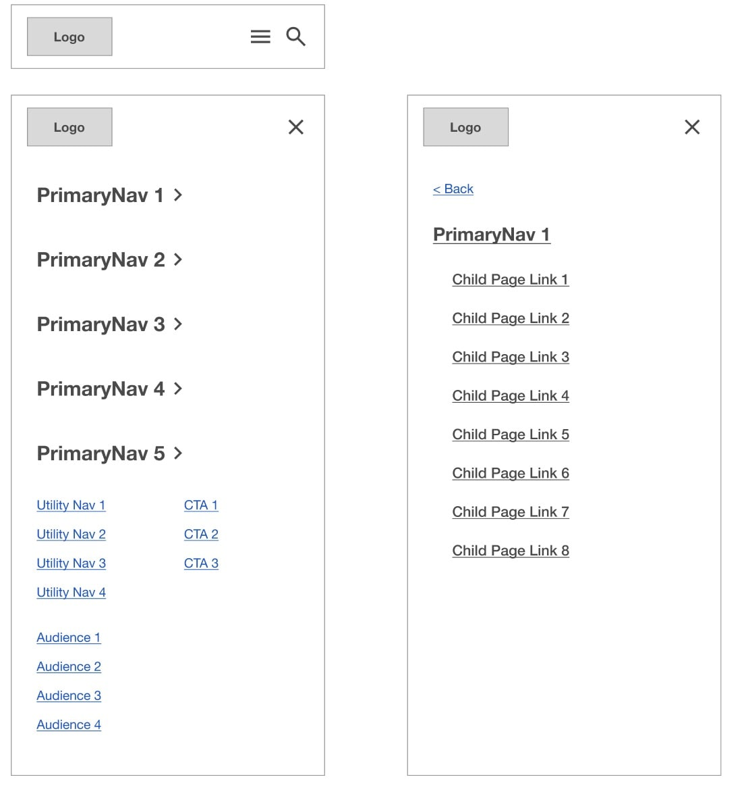
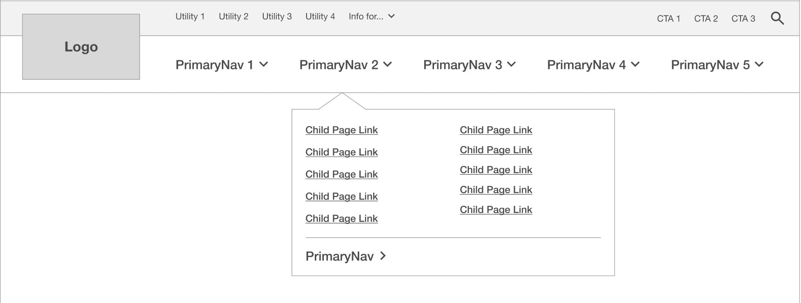

import Tabs from "@theme/Tabs";
import TabItem from "@theme/TabItem";


# Site Header

The site header comes with 2 built-in variations, a "Full" version wich displays dropdown menus (if there are child elements) and a "Hybrid" version.
[More information can be found in the wireframes](https://www.figma.com/proto/6rjiTrzRov6VwxFgwVPbXg/UX-Starter-Doc?page-id=1%3A98&node-id=141-699&viewport=755%2C325%2C0.08&t=eN5CbnlbijyARmGo-1&scaling=min-zoom&content-scaling=fixed&starting-point-node-id=355%3A13806).

## Variations

The default mode fort he site header is the "Full" version. 
To change to a different variation: 
<Tabs groupId="icl-versions">
  <TabItem value="v3.0" label="ICL Version 3+ (Astro)">
  In **global.json** (`src/data/global.json`) and change the `type_hybrid` under "site header".
  </TabItem>
  <TabItem value="v2.0" label="ICL Version < 3 (Pattern Lab)">
  In **data.json** (`source/data/data.json`) and change the `type_hybrid` under "site header".
  </TabItem>
</Tabs>

**When "type_hybrid" set to `false` - it will show the "full" version**:

For Full:

```json
"site_header": {
    "type_hybrid": false,
}
```

For Hybrid:

```json
"site_header": {
    "type_hybrid": true,
}
```

### Utility Menu
The utility menu is optional, the boolean setting "display_utility_nav" is available to toggle this. For example to hide the menu:
```json
"site_header": {
    "display_utility_nav": false,
}
```

### Search
The search trigger can either be placed in the utility menu (if it is visible) or in the main menu (where it's placed by default). The boolean setting `search_in_main` is available to toggle this. For example, the default placement of the search trigger is in the main menu, if `search_in_main` is set to `false`, it will be placed in the utility menu:
```json
"site_header": {
    "search_in_main": false,
}
```

The search trigger (and subsequent search form) are optional, the `display_search` setting can be used to toggle visibility (by default it's visible):
```json
"site_header": {
  "display_search": true,
}
```

## Variables

The partial file `variables.css` contains custom properties (variables) used in conjunction with the site header, to be updated per project based on design needs. These custom properties need to be kept in place as they are used in various formulas (for example, to determine the `padding-top` value of the `<main>` section). The relevant variables and default values are as follows:

```css
:root {
   --header-top-height: 90px;
  --header-logo-width: 106px;
  --header-main-menu-height: 164px;
  &:has(.site-header__top .site-header__utility),
  &:has(.site-header__top .site-header__audience),
  &:has(.site-header__top .site-header__ctas) {
    --header-main-menu-height: 100px;
  }
  @media (--lg_desktop) {
    --header-top-height: 0rem;
    --header-logo-width: 212px;
    &:has(.site-header__top .site-header__utility),
    &:has(.site-header__top .site-header__audience),
    &:has(.site-header__top .site-header__ctas) {
      --header-top-height: 64px;
    }
  }
}
```

- `--header-top-height` refers to the top section applied to `site-header__top` which appears on mobile and desktop, typically containing utility and audience links
- `--header-main-menu-height` refers to the height of the lower section of the header, typically containing main menu links and dropdowns
- `--header-logo-width` refers to the width of the site logo

## Parts and Variations

### Mobile

The mobile version for all variations is identical. A hamburger menu opens the popover menu with submenus sliding in from the right side:


### Full Variation

([Description from wireframes](https://www.figma.com/proto/6rjiTrzRov6VwxFgwVPbXg/UX-Starter-Doc?page-id=1%3A98&node-id=141-699&viewport=755%2C325%2C0.08&t=eN5CbnlbijyARmGo-1&scaling=min-zoom&content-scaling=fixed&starting-point-node-id=355%3A13806)) The Primary Navigation operates by click. Clicking any of the Primary Navigation labels shows a drop-down menu with links to child pages and a link to the top-level page at the bottom of the menu. This toplevel page link should be styled slightly different to indicate that it is the top-level link. Clicking the Primary navigation label once more closes the menu. If a Primary Navigation section does not have any child pages, instead of showing the drop-down menu, the user will be navigated to that page. The Audience menu operates by click to show Audience links. In the Audience menu, there is not a link to a top-level page. Clicking any of the Utility or Calls to Action links take users directly to a page.


### Hybrid Variation

([Description from wireframes](https://www.figma.com/proto/6rjiTrzRov6VwxFgwVPbXg/UX-Starter-Doc?page-id=1%3A98&node-id=141-699&viewport=755%2C325%2C0.08&t=eN5CbnlbijyARmGo-1&scaling=min-zoom&content-scaling=fixed&starting-point-node-id=355%3A13806)) This shows "Priority links", which are those deemed to be priority and featured outside of the hamburger menu. Clicking any of these links takes users directly to a page. These Priority links can be any link in the sitemap, not just Top Level pages. Clicking the Priority links operates by click. Clicking the hamburger button opens the full hamburger menu. The Audience menu operates by click to show Audience links. Clicking any of the Utility or Calls to Action links take users directly to a page.


### Popover Menu (Desktop - Hybrid)

([Description from wireframes](https://www.figma.com/proto/6rjiTrzRov6VwxFgwVPbXg/UX-Starter-Doc?page-id=1%3A98&node-id=141-699&viewport=755%2C325%2C0.08&t=eN5CbnlbijyARmGo-1&scaling=min-zoom&content-scaling=fixed&starting-point-node-id=355%3A13806)) This shows the Primary Navigation, CTAs, Utility Navigation, and Audience Navigation. Clicking any of the CTAs, Utility, or Audience Links takes users to a page. Clicking any of the Primary Navigation links toggles that section label and then shows the Primary Navigation submenu with link to the parent page and links to child pages. The arrow is optional, as it is used to indicate if the menu link shows child links or not.


### Search

([Description from wireframes](https://www.figma.com/proto/6rjiTrzRov6VwxFgwVPbXg/UX-Starter-Doc?page-id=1%3A98&node-id=141-699&viewport=755%2C325%2C0.08&t=eN5CbnlbijyARmGo-1&scaling=min-zoom&content-scaling=fixed&starting-point-node-id=355%3A13806)) Clicking the search icon displays a search field underneath the header. Clicking the search button takes users to the search page. When this search is open, users cannot scroll. This search can be dismissed by clicking outside the search modal or the x button.

