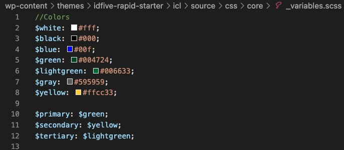
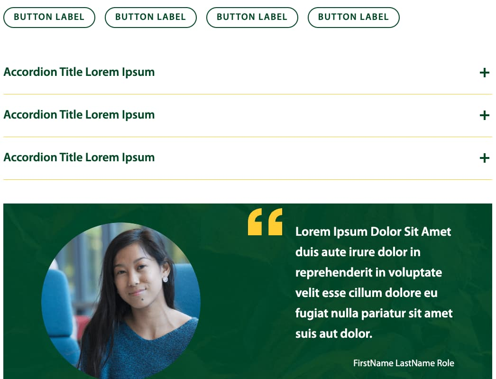
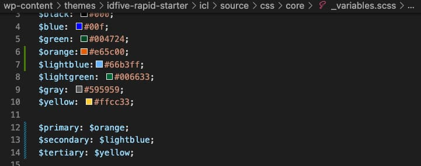
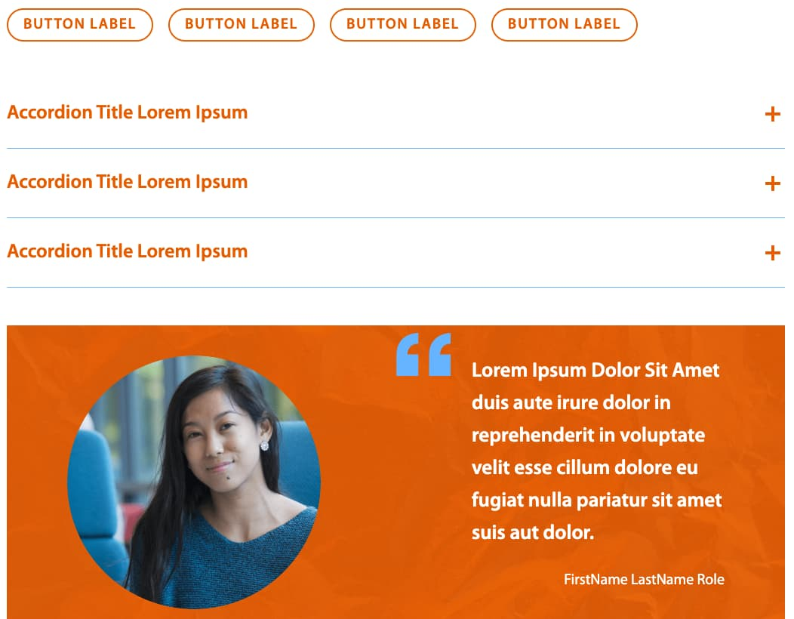
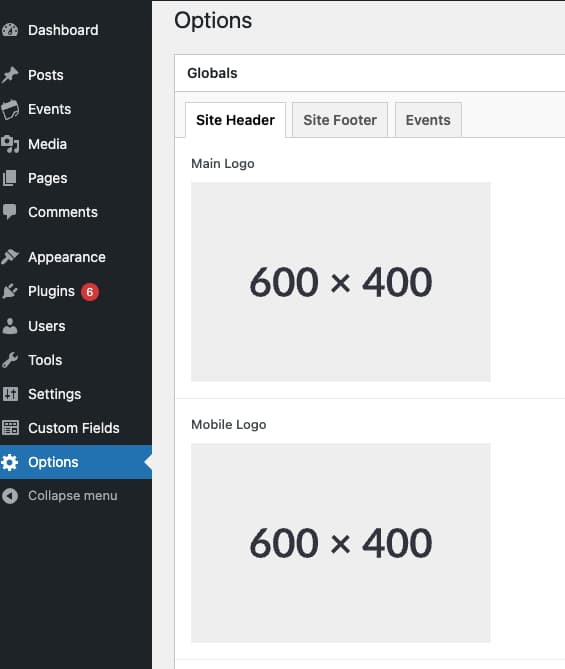

# Under 50

## What is the Under50 project

The Under50 project is a wordpress website template for clients to pay under $50k for a quick to customize, ready made website that can be completed with much less development time to put together.

The dev site can be found here: [https://dev-under-50-project.pantheonsite.io/](https://dev-under-50-project.pantheonsite.io/)

The general expectation is that using the completed template of most components in the pattern lab starter, and with little input from design we can quickly customize and create a new website that is up to the standards of IDFive.

## Creating a new Under50 project

The first step is to create a new wordpress website in pantheon. In the example below your project’s label will be “Your New U50 Project” with a name of “your-new-u50-project”.

Make sure you have Terminus installed. Installation instructions are [found here](https://docs.pantheon.io/terminus/install).

Install terminus site clone plugin. The following code will use terminus itself to install the plugin. There are alternative install methods [listed here](https://github.com/pantheon-systems/terminus-site-clone-plugin/blob/master/README.md).

`terminus self:plugin:install pantheon-systems/terminus-site-clone-plugin`

Make sure you are logged in to Pantheon on your machine via terminus with:

`terminus auth:login --machine-token=yourreallylongmachinetokenstring`

Use the terminus site clone to copy the Under 50 projects’s dev environment to your new projects dev environment.

`terminus site:clone under-50-project.dev your-new-u50-project.dev`

It may take a few minutes before you’re able to see it after it is done.

## Copying a new project to your local machine.

If you use `lando init` to copy the project from pantheon to your local machine, lando will automatically update your lando.yml to an updated machine site name and id. However if you clone the site to your machine using git, the cloned site’s lando.yml site will be identical to the original site. So be sure to change it, manually, to a new name as this can cause many issues both locally and remotely.

## Styling your new U50 site

On your new Under 50 Project you will have a bit of sample content with pages explaining all the different components. For now, leave this in place as it will help with Quality Control. But Now your goal is to get your new project to be more inline with its design.

One thing that will do a lot of the heavy lifting of getting your colors in order. In the `wp-content/themes/idfive-rapid-starter/icl/source/css/core/_variables.scss`, you will find colors listed and variables $primary, $secondary and $tertiary. These are calling other colors and most if not all of the components are calling these variables, so changing which colors these call will change most of the site at once. Though you will still have to adjust as needed.

Things to check for:

- Max page content width
- Fonts
- Margins
- Header styles
- Breadcrumbs
- Event page formatting (i.e. the calendar for the date picker)

To upload the new website’s logo can be found by logging into the wordpress website and using the options menu. These global options include options for the logo and mobile logo, The CTA links above the main navigation. And the footer content.

Some U50 projects will require some additional functionality to add to the project. Examples from CRCG:
developing upcoming events and past events shortcode.
Adding pagination to the news feed at the threshold of 9+ posts
Adding post types using ACF fields
Etc.

This will probably be unique from project to project. Each Project will be slightly different and come with its own challenges. If you discover anything that is wrong with the core of U50 add it as a trello ticket in the Under 50 [Trello board](https://trello.com/b/VwWXAr21/under-50-project). Or, if proposed new functionality would benefit future u50 sites, build said feature in u50 first, or suggest backporting.

Once you’re confident that everything functions the way it should, you can now remove the dummy content. This will include removing all pages, posts, archived events, and images. Actual client content should now be entered, and may require additional QC.
