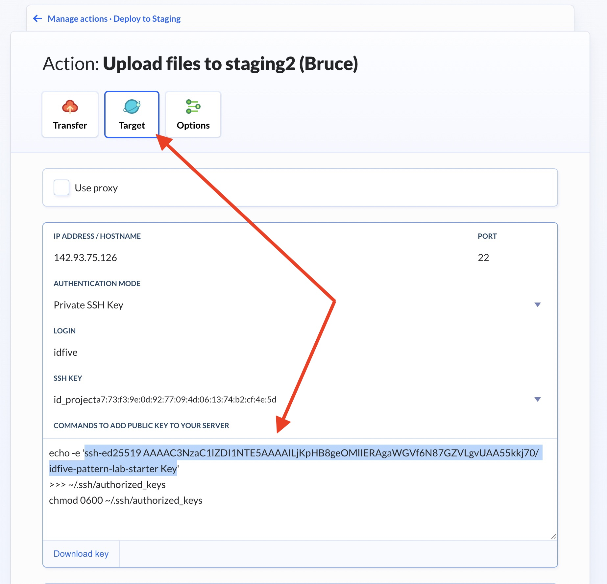

# Buddy Pipeline Setup

We use the app [Buddy](https://app.buddy.works/idfive) to deploy code to our staging server. The [idfive Component Library](https://bitbucket.org/idfivellc/idfive-component-library/src/master/) contains a `buddy.yml` file which will need some minor modifications in order to setup the pipeline properly.

- [Link to video version of the tutorial](https://vimeo.com/734507911/3db532dc02)

## Steps At A Glance

- Setup repo, buddy.yml file, and push
- SSH into staging server and create directory
- Create project in Buddy, imported from the repository
- Paste ssh key from Buddy onto server
- Deploy and confirm

## Steps In Detail

### Setup repo, buddy.yml file, and push

- In [Bitbucket](https://bitbucket.org/idfivellc/), select "Create" from the top menu and choose "Repository"
- The "Workspace" & "Project" should both be set to "idfive"
  
- Clone this newly created repository down to your local machine
- Download a copy of the [idfive Component Library](https://bitbucket.org/idfivellc/idfive-component-library/src/master/). Downloading is preferred here as opposed to cloning, to easily remove the git history
- Place the icl contents into the new repo
  — Open up the `buddy.yml` file (in the root) and update these two instances of the paths to your new project directory that you'll be creating in the next step: line 5 (`target_site_url`) and line 48 (`remote_path`), for example `target_site_url: "https://staging2.idfive.com/[path-to-your-directory]/"` and `remote_path: "/var/www/staging2.idfive.com/public_html/[path-to-your-directory]"`

### SSH into staging server and create directory

- In a terminal window enter `ssh idfive@staging2.idfive.com` to ssh into the staging server
- `cd /var/www/staging2.idfive.com/public_html/` to navigate to the `public_html` directory
- Create a new directory (`mkdir`) for your site to go into (should be the same as what was entered into the buddy.yml file previously)

### Create project in Buddy, imported from the repository

- From the main [Buddy page](https://app.buddy.works/idfive), click "Create Project"
  
- The next screen in Buddy will give the opportunity to select the Bitbucket repo created in the previous steps, select and the import process will begin
  
- Once the import is complete, go to the project and click "Pipelines" from the left. You should see a pipeline imported from the yml file called "Deploy To Staging", select this pipeline.
  
- In the pipeline screen you should see the steps listed out that will be performed: `Execute: npm install`, `Execute: npm run build`, `Execute: npm run fractal:build` & `Upload files to staging2 (Bruce)`. Click `Upload files to staging2 (Bruce)` to get the ssh key to authenticate.
  
- In the `Upload files to staging2 (Bruce)` screen, scroll down to `Env's key` and copy from `echo -e`... down to before the `chmod 0600 ~/.ssh/authorized_keys` line. You should see that the Authentication mode is set to `id_project key`.
  

### Paste ssh key from Buddy onto server

- SSH back into the staging server `ssh idfive@staging2.idfive.com` (or navigate to the root if you're still in the `public_html` directory)
- From the root paste in the code that's been selected
- This isn't required, but if you want to confirm that your key is pasted in properly, enter `- vim ~/.ssh/authorized_keys` and scroll down to view at the bottom, `:quit` to exit vim
- `exit` once complete

### Deploy and confirm

- Back in Buddy from either the main Pipeline of the project, or from within the "Deploy to Staging" pipeline — click "Run"
  

- You can see Buddy work through each step (and the duration per step) from within the "Deploy to Staging" screen by clicking "Actions" while it's running
  
- If all steps have completed successfully, visit the staging site to confirm. The will be `https://staging2.idfive.com/[your-new-site-name-here]/fractal/`
  
