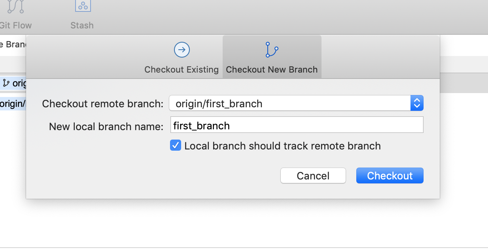

# Git Usage

## Set Up

### Create a Repository at Github

[https://github.com/new](https://github.com/new)


_Screen for creating a new repository on Github._

[https://github.com/michaelscraven1972/learning](https://github.com/michaelscraven1972/learning)


### Clone Repository Locally From Command Line


```
$git clone https://github.com/michaelscraven1972/learning learning1
```


This creates a directory called learning1 in the current directory.


### Using Sourcetree

New > Clone from URL  - enter URL and local directory location.


_The dropdown gives a number of options, including to open existing local or remote repositories, or create new ones._

“Clone from URL” brings up a dialog where you can enter the URL of the repository.


_Sourcetree will give default names and paths once it validates the repository_


## Fetch/Pull

If working collaboratively with other developers, the local repository will get behind. Git fetch gets the latest meta data from the remote repository so that the developer can see what  changes have been made. Git pull, however pulls those changes and tries to integrate them with the local repository.


### From the Command Line


```
$git fetch
```


_Git fetch outputs the changes that have been made on the remote_


```
$git pull
```


_On pull, the files are updated_


### Sourcetree

If the local repository is behind, Sourcetree will show that a pull needs to be done.


_The pull button shows that there are two commits to pull. The graph also shows that this repository is two behind._

When the user clicks the pull button, a dialog box comes up:


_The dialog box allows selection of which branch and repository to pull from._


## Add/Commit


### From the Command Line


```
$git status
```


Show  tracked and untracked files and changes yet to be committed.


_The status command shows that the file first.txt has been edited. Stage the file with add._


```
$git add <file name>
```


Stage file and start tracking the file. Added files can then be committed.

```
$ git commit -m <message>`
```

Will commit the added files with a message.


### Sourcetree

As files are changed in the local repository, Sourcetree records that files have changes that need to be staged and committed.


_Both the graph and the commit button show that a file has changed and needs to be committed._

After clicking on commit, the changed files display on the left panel for review before being staged. Once, staged, the files still need to be committed.


_The staged and highlighted file in the left shows the changes in the right panel. Commit is not complete, though until a commit message and commit button clicked. Also, you can see we are on the master branch._

More information about any commit can be found by clicking anywhere along the graph. This includes the author of the commit, the commit hash, and the commit message.


## Push


### Command Line

The push command pushes changes to a branch to the remote repository.


```
$git push <remote> <branch>
```


### Sourcetree

After files are committed, the push button will show a number like the commit button did. Pushing the button will generate a dialog box that asks which repository and which branch.

Unlike on the git command line, on push Sourcetree by default pushed tags:


## Branching


### From the Command Line


```
$git branch
```


Shows the branches available and which branch I am on.


_Output from git branch, highlighting the branch the repository is on_


```
$git checkout -b first_branch
```


Creates and then checks out a new branch.


```
$git checkout master
```


Brings me back to master.


```
$git add .
```


Added files for commit.


```
$git config credential.username "michaelscraven1972"
```


Change user for this repo.


### Sourcetree

A new branch can be created by right clicking on the branch button on the left navigation.


Selecting “New Branch” brings up a dialog box:


The dialog lets the user select whether to switch to the new branch and a specific commit to branch from.

Clicking on the new branch, the graph shows that the new branch is forking off main.


_New branch appears on Fetch in Sourcetree_

Sourcetree only shows local branches on the left, not remote. The top of the tree mode and the Remotes section on the left allows for show or hide remote branches.


_The remotes area._

To create a local branch of the remote, right click on the remote branch and then checkout or double click the remote branch.

This brings up:




### Merge conflicts

File has been altered while it is being worked on locally. Pull the change locally, merge conflict. On the command line, will say (Merging) at prompt until changes are committed.


_In VS Code, links  for accept current (change that is going in from local), accept incoming, and accept both._

Often merge conflicts are more complicated than the screen capture above. Merge conflicts indicate that git cannot easily merge files and files will need to be manually reviewed, edited  and committed.


## Tagging

Tags are tied to commits. They allow a name to be given to a point in the repository. They are not by default pushed with a push from the command line. As we use tags at idfive, a new tag pushed to a github repository that has been submitted to packagist kicks off a new release.


### From the Command Line

To push tags along with the branch, add --tags flag. Like this:


```
$git push origin master --tags
```

Create a tag on the command line:

```
$git tag -a <tag_name> -m "Tag message"
```

You can see all tags with:

```
$git tag
```


And you can see what commit a tag is connected to by typing:

```
$git show <tag_name>
```


_The tag 8.1.14 is connected to the commit beginning 1fa861e292_

Old commits can be tagged after the fact with:

```
$git tag -a <tag_name> commit
```


_With the -m flag adding the message “Release 2.1” a past commit is tagged_

Individual tags can also be checked out, but that puts you in a detached head state:

```
$git checkout <tag_name>
```

### Sourcetree

In SourceTree, create a new tag by right clicking on “Tags” on the left. You can also see all tags by clicking on “Show” next to the tags button.


_Adding a tag and the list of tags in the left panel._

# Gitflow

[https://www.atlassian.com/git/tutorials/comparing-workflows/gitflow-workflow](https://www.atlassian.com/git/tutorials/comparing-workflows/gitflow-workflow)

idfivw uses the gitflow methodology for development. Gitflow defines a set of branches and specific purposes for each kind of branch. In addition to  the master branch, gitflow uses a develop branch, feature branches, release branches, and hotfix branches.

*   **develop**  - which is the starting branch for all **feature** branches. Develop can be very dynamic, with new feature code being merged in all the time.
*   **feature** - feature branches are created to work on new functionality.They are merged back to develop when complete.
*   **master** -  is very stable, is always production ready. No feature branches are made from master.
*    **release**  - a branch created from **develop** when a new set of features is ready to be merged into master
*   **hotfixes** -  created from master to repair bugs found in the production code after a release.

## Set Up

### From the Command Line

Install gitflow on the command line with:

```
$brew install git-flow
```

After installation, to begin gitflow for a project from the command line:

```
$git flow init
```

Git flow will ask questions for setting up the branches.

### Sourcetree

Sourcetree has a button for setting up gitflow:


The default set up in sourcetree will set up the different branch types in their own directories:


As stated here: [https://developers.idfive.com/#/general/git/standards](https://developers.idfive.com/#/general/git/standards), this setup will not work with Pantheon multidev. Thus, usually this is changed to prefixes, “f-”, “r-”, and “h-”. In Sourcetree, the config file will have to be edited to reflect the changes made in the GUI. After this, branch names will have the prefix and will not need to be added. As the [developer documents](https://developers.idfive.com/#/general/git/standards) note, changing these prefixes sometimes does not actually work (bug in Sourcetree potentially), and that the config file for Sourcetree needs to be edited:


_Changing prefixes._


_The edt config file button is on the advanced tab for the settings._


_The edit config file_


## Using Gitflow

### From the Command Line

With git flow installed, a new feature branch is created with the following:

```
$git flow feature start <branch_name>
```

When the feature is complete, the feature branch is merged with develop and the feature branch deleted. The command:

```
$git flow feature finish <branch_name>
```

Merges the features branch into develop and deletes the feature branch.

Likewise, hotfix and release branches can be created. Both hot fix and release branches are normally merged back into both master and develop when they are finished.


### Sourcetree

Once Gitflow is set up, clicking on the Gitflow button again gives the option to set up a feature. Give the feature branch a name. The repo will switch to the new branch.


_The Gitflow dialog for starting a new branch_


_Name the feature on the next dialog_

Once complete with the feature, highlighting the branch and then clicking Gitflow provides the option to finish the feature:


Clicking on Finish Current gives the option to save or delete the feature branch as the feature is merged into develop.

# Commit Messaging


## When to Commit

[Jason McCreary](https://jasonmccreary.me/articles/when-to-make-git-commit/) outlines a simple set of two rules for when to commit.

1. Commit when there is a complete unit of work
1. Commit anything that you may want to roll back

The second rule is sort of a special case. The first is interpretive.

What is not a good idea, is committing based on anything as arbitrary as time. Rather all changes in one commit should be related to one relatively small unit of work. Being mindful of the second rule and the fact that often commits need to be rolled back, it is good to lean on committing frequently.

## What should be in a Commit Message

Commit messages and how they should be formatted connect with commits themselves in that commits messages, so they can be easily understood, should be short and direct. Conversely, commits, so they can be easily rolled back and reviewed, should be of a small, single unit of related changes, which helps in writing succinct commit messages. So, if it takes too long to meaningfully outline the changes in a commit, it should probably be broken up.

Some general commit message tips (credit to Tim Pope for inspiration)::

1. Capitalized, short (50 chars or less) summary
1. More detailed explanatory text, if necessary.  Wrap it to about 72characters or so.  In some contexts, the first line is treated as the subject of an email and the rest of the text as the body.  The blank line separating the summary from the body is critical (unless you omit the body entirely); tools like rebase can get confused if you run the two together.
1. If bugify/trello ticket for this exists, add a reference(s) to them at the bottom,like so: Resolves: #123


# Reviewing Commit Histories

The basic command for reviewing recent commits is:

```
$git log
```

Adding the --graph flag gives a visual representation of the commit history:


_Git log with the graph flag_.

The graph represented above shows where the first_brach flag (in red) forks off of the master branch and is then merged later at commit 48eff2fed88f.

The same information is displayed in Sourcetree like this:


## Getting Information for an Individual File


### Command Line

The git log command also allows displaying the information for a single file. Without any flags, git log shows an abbreviated output like the git log command, only showing commits that affect the named file.


However, with the -p flag a full display including all changes outputs

```
$git log -p <file name>
```


### Sourcetree

In Sourcetree, get the commit history for an individual file by clicking on a commit, right clicking on one of the files and going to log selected.


_Here, right clicking on a file from a highlighted commit shows the Log Selected … option_

From there, it is possible to each commit where the file changed and what changes were made:


_The right panel shows how the file changed in this commit_


### VSCode

The new (as of version 1.44) Timeline feature in VSCode allows you to review file histories as well. Simply highlight a file and open the Timeline panel on the left.


_VSCode with timeline open and commit highlighted (light high contrast color theme)_


_Close up of the timeline in the left panel_

Changes to the file are in the right panel.


_Changes  made to the file in the commit. Green highlighting indicates new lines._
